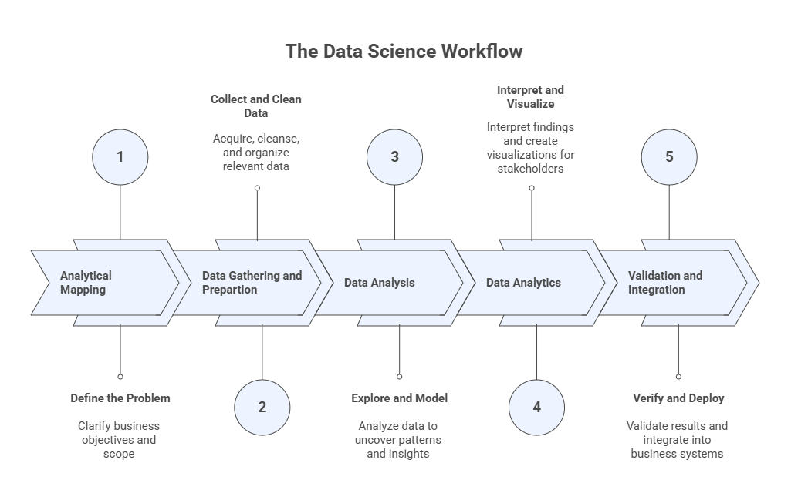
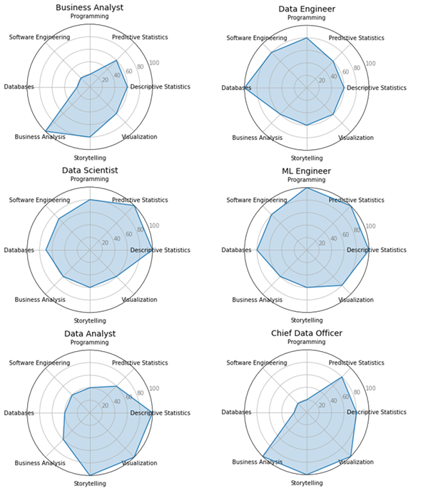

# 1 — Introduction to AEDA: History, Concepts, Analytical Process Flow, and GenAI Foundations

**Advanced Exploratory Data Analysis (AEDA)** is the foundation for any data-driven solution, whether the goal is insight generation, decision support, or automation. This opening module introduces the historical, conceptual, and analytical context of AEDA, situating it within the broader data science and artificial intelligence ecosystem. 

Students will explore how data analysis evolved alongside advances in computation and AI, where AEDA fits in the analytical workflow, and why understanding data through descriptive analysis and visualization is a prerequisite for effective modeling, storytelling, and dashboard design. The module also establishes how Generative AI can be used responsibly as a co-pilot in exploratory analysis, supporting — but never replacing — statistical reasoning, visualization literacy, and human judgment.

## Learning Objectives

By the end of this module, students should be able to:

1. Explain what AEDA is and distinguish it from related concepts such as data analytics, data mining, and machine learning. 
2. Describe the **data science / analytics workflow** as an end-to-end process and locate where AEDA fits.  
3. Identify common **careers/roles** in data science and connect them to core knowledge/skills.   
4. Summarize major milestones in the history of AI and explain why **data availability + compute + algorithms** change what is possible.   
5. Explain at a high level what **prompt engineering**, **context engineering**, **foundational models**, and **GenAI ecosystems** mean in the context of doing AEDA.   

## 1.1 Core Ideas (Conceptual Notes)

### What AEDA is (and is not)
Exploratory Data Analysis (EDA) encompasses a broad set of techniques focused on manipulating, summarizing, and visualizing data without performing formal modeling or statistical inference. 
The primary purpose of EDA is to develop a deep understanding of the data itself, its structure, behavior, and key patterns, by means of descriptive operations and visual representations. 
As the initial phase of the analytical workflow, EDA plays a critical role in shaping subsequent decisions related to modeling, inference, and advanced analytics, often determining which methods are appropriate and which variables are most informative.

In essence, the main objectives of EDA are to:

- Understand the overall structure and distribution of the data.
- Summarize the main characteristics of variables using descriptive measures.
- Extract meaningful insights and indicators from raw data.
- Assess variable relevance and support feature selection.
- Explore and visualize relationships among variables.
- Detect anomalies, outliers, or unusual patterns.
- Prepare the data for the application or selection of learning-based methods.

### The Data Science Workflow and Where AEDA Fits
AEDA sits in the portion of the workflow where we **explore, summarize, clean, and visualize** data to understand it before building downstream solutions. The course program explicitly positions AEDA before specialized analytics.  
The book reinforces that EDA becomes critical for making data suitable for modeling and for transforming raw data into insights that can inform AI solutions. 

### Careers in data science: roles & responsibilities (high-level)
Examples of roles discussed include: **Business Analyst, Data Scientist, Data Analyst, Data Engineer**, and related leadership/architecture roles.   
One useful framing is:  
- Data Scientist: identifies suitable data, designs/applies algorithms, analyzes results, and bridges business ↔ analytics. 
- Data Analyst: extracts data, applies tools for insights/visualization/KPIs, consolidates into reports/dashboards. 
- Data Engineer: manages ETL (extract-transform-load), pipelines, and transformations that enable analysis.  

### A brief history of AI (why it belongs in an AEDA course)
A brief history of Artificial Intelligence is essential in an Advanced Exploratory Data Analysis (AEDA) course because the evolution of AI is tightly coupled with the availability, quality, and understanding of data. Many of the early successes and failures of AI can be traced not only to algorithmic limitations, but also to insufficient data, inadequate data preparation, and poor understanding of data structure and variability. Modern AI breakthroughs—particularly those based on statistical learning and deep learning—became possible only when large volumes of data could be collected, explored, cleaned, summarized, and visualized effectively. AEDA provides the analytical foundation that enables these advances by revealing patterns, distributions, relationships, and anomalies in data, guiding appropriate model selection and interpretation. Understanding the historical trajectory of AI helps students recognize why exploratory analysis is a prerequisite for reliable, ethical, and effective AI systems, rather than a secondary or optional step in the analytical workflow.

### GenAI Foundations (Practical Framing for AEDA)
To use AI instrumentally in education, instructors must understand:

**Prompt Engineering**
- Prompts = instructions to the model
- Structured prompting leads to predictable, high‑quality outputs
- Prompt patterns (e.g., instructional, role, chain-of-thought, few-shot)
- **Anatomy of a Prompt**: Instruction, Context, Input Data, Output Format
- **Meta-prompt**: prompts used to create, structure or refine other prompts

**Context Engineering**
- Designing the whole environment around the prompt
- Roles, audience, tone, documents, constraints
- Retrieval-augmented workflows
- Essential for building AI Workspaces and Personalized Assistants

**Foundational Models & LLM Ecosystems**
- Multimodal LLMs, such as, ChatGPT, Claude, Gemini, Perplexity, Copilot, Grok
- Understanding tool ecosystems determines what is possible in teaching
- Strengths, limitations, and best-fit teaching use cases

You are strongly encouraged to have a look at our **AI Literacy** program, which will guide you through the basics of Prompt and Context Engineering, and also foundational models and LLM ecosystems. These will form the foundation necessary for a good understanding and development of AEDA. 

> In this course, GenAI is treated as a **co-pilot for exploratory work**, not a replacement for statistical reasoning and visualization literacy.

## 1.2 Reflection

Understanding the historical evolution of Artificial Intelligence provides important perspective for students of Advanced Exploratory Data Analysis. Many of the successes and failures in AI history were driven not only by algorithmic limitations, but also by constraints related to data availability, data quality, computational power, and analytical understanding. Reflecting on this history reinforces a central message of this course: reliable insights and effective AI systems depend on rigorous exploratory analysis. As you progress through AEDA, consider how descriptive statistics, visualization, and data characterization shape modeling decisions, expose hidden assumptions, and support ethical and responsible use of AI. Also reflect on the role of Generative AI as an analytical co-pilot—powerful when guided by sound data reasoning, but limited without proper context and human judgment.

## Further Reading

Students wishing to deepen their understanding of the topics introduced in this module are encouraged to consult the references listed in the course syllabus bibliography, including:

- **De Castro, L. N. (2026).** *Exploratory Data Analysis: Descriptive Analysis, Visualization, and Dashboard Design*. CRC Press.  
- **Triola, M. F. (2017).** *Elementary Statistics* (13th ed.). Pearson.  
- **Knaflic, C. N. (2015).** *Storytelling with Data: A Data Visualization Guide for Business Professionals*. Wiley.  
- **Ward, M., Grinstein, G. G., & Keim, D. (2015).** *Interactive Data Visualization: Foundations, Techniques, and Applications* (2nd ed.). CRC Press.  
- **Wilke, C. O. (2019).** *Fundamentals of Data Visualization*. O’Reilly Media.  

These readings provide complementary perspectives on exploratory data analysis, visualization principles, data storytelling, and the analytical foundations that support modern data science and artificial intelligence.
