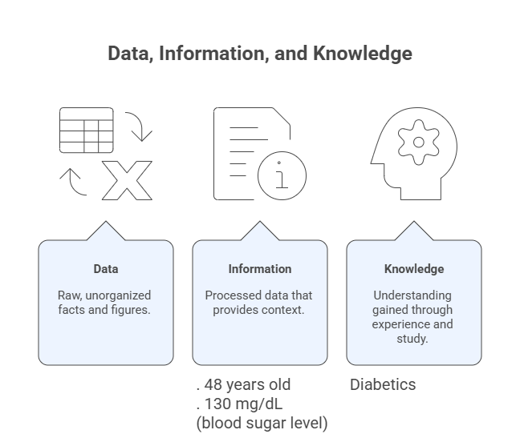
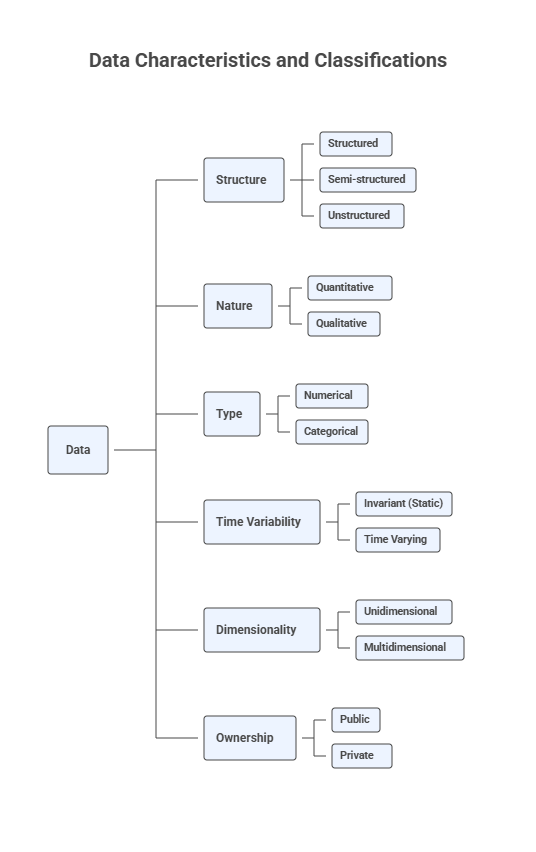

# 2 — Data Description and Preparation

Before any meaningful exploratory analysis, visualization, or AI-supported insight generation can occur, data must be **understood, described, and prepared**. This module introduces the conceptual and practical foundations required to transform raw data into analyzable data.

This module builds directly on Module 1 by moving from the analytical process flow to the first operational stage of AEDA: understanding what the data is, how it is structured, and how it should be prepared for analysis.

## Learning Objectives

By the end of this module, students will be able to:

1. Represent datasets using tabular and mathematical forms.
2. Interpret and construct data dictionaries.
3. Classify data according to structure, nature, type, time variability, dimensionality, and ownership.
4. Recognize benchmark datasets commonly used in exploratory data analysis.
5. Identify common data quality problems in raw datasets.
6. Apply fundamental data preparation techniques such as sampling, missing-value handling, and normalization.

## 2.1 Tabular and Mathematical Representations

### Data, Information, Knowledge

**Data** can be understood as any element that can be stored, transferred, processed, or transformed to convey meaning, including numbers, words, images, sounds, and graphs. From a computational perspective, anything that can be digitally stored or manipulated qualifies as data. On its own, data has no inherent meaning; it becomes **information** only when placed within a context. When this information is interpreted, analyzed, and applied to support decisions or generate insights, it evolves into **knowledge**.

 

**Figure:** From data to information to knowledge.

### Tabular Representation

The **tabular representation** is the most common way to organize data in exploratory data analysis.

- Rows represent objects, instances, patterns, records, or observations.
- Columns represent variables, attributes, or features.
- Each cell contains the value of a variable for a given object.

Tabular data structures are the foundation of spreadsheets, relational databases, BI tools, and data science libraries.

**Table:** First four objects of the Car Evaluation Dataset available at UCI.

| Car ID | Buying | Maintenance | Doors | Persons | Lug_boot | Safety | Class |
|--------|--------|-------------|-------|---------|----------|--------|-------|
| 1      | vhigh  | vhigh       | 2     | 2       | small    | low    | unacc |
| 2      | vhigh  | vhigh       | 2     | 2       | small    | med    | unacc |
| 3      | vhigh  | vhigh       | 2     | 2       | small    | high   | unacc |
| 4      | vhigh  | vhigh       | 2     | 2       | med      | low    | unacc |

### Mathematical Representation

Mathematically, a dataset can be represented as a matrix:

$S = {x_i \mid i = 1, \ldots, N},$

where each object \(x_i\) is an \(m\)-dimensional vector given by

$\mathbf{x^i} = \big[ x_j^i \big]_{j = 1, \ldots, m}.\$

where:
- $N$ is the number of objects
- $m$ is the number of variables

This representation supports statistical analysis, linear algebra operations, optimization, and machine learning algorithms.

 

**Figure:** Graph for variables ‘safety’ vs ‘lug_boot’ of the four objects in the previous table.

## 2.2 Data Dictionary

A **data dictionary** provides a structured description of a dataset’s variables and their semantics. Typical elements include:

- Variable name
- Description and meaning
- Data type
- Valid values or ranges
- Units of measurement
- Missing-value indicators

### Why Data Dictionaries Matter

Data dictionaries:
- Reduce ambiguity and misinterpretation
- Improve reproducibility
- Support collaboration across teams
- Provide essential context for automated analysis and AI-assisted workflows

**Table:** Example of a simple data dictionary for the Car Evaluation Dataset.
| Variable name | Definition (meaning)                  | Domain                         |
|---------------|---------------------------------------|--------------------------------|
| Car ID        | ID number of each car in the dataset  | Integer number                 |
| Buying        | Buying price                          | {v-high, high, med, low}       |
| Maintenance   | Price of the maintenance              | {v-high, high, med, low}       |
| Doors         | Number of doors                       | {2, 3, 4, 5-more}              |
| Persons       | Number of persons accommodated        | {2, 4, more}                   |
| Lug-boot      | Trunk size                            | {small, med, big}              |
| Safety        | Level of safety                       | {low, med, high}               |
| Class         | Car acceptability                     | {unacc, acc, good, vgood}      |

## 2.3 Classifying Data

Data can be classified along multiple dimensions. These classifications guide analytical decisions, visualization choices, and preparation strategies.

 

**Figure:** Different forms of classifying data.

### 2.3.1 Structure

- **Structured data**: Fixed schema (tables, spreadsheets, relational databases)
- **Semi-structured data**: Flexible schema with metadata (JSON, XML)
- **Unstructured data**: No predefined structure (text, images, audio, video)

### 2.3.2 Nature

- **Quantitative data**: Numerical measurements
- **Qualitative data**: Descriptive or categorical attributes

### 2.3.3 Type

- **Numerical data**: Discrete or continuous values
- **Categorical data**: Nominal or ordinal categories

### 2.3.4 Time Variability

- **Invariant (static) data**: Values do not change over time
- **Time-varying data**: Values evolve across time

### 2.3.5 Dimensionality

- **Unidimensional data**: One variable of interest
- **Multidimensional data**: Multiple variables analyzed jointly

### 2.3.6 Ownership

- **Public data**: Freely available datasets
- **Private data**: Restricted or proprietary datasets

## 2.4 Datasets Used in the Course

The following datasets are used throughout the course to illustrate AEDA concepts:

- Mammographic Dataset (https://archive.ics.uci.edu/ml/datasets/Mammographic+Mass)
- Forest Fires Dataset (https://archive.ics.uci.edu/ml/datasets/forest+fires)
- Iris Dataset of Fisher (https://archive.ics.uci.edu/ml/datasets/iris)
- Auto MPG Dataset (https://archive.ics.uci.edu/ml/datasets/auto+mpg)
- Gapminder Dataset (https://www.kaggle.com/datasets/albertovidalrod/gapminder-dataset)
- NaturalEarth Low Resolution Dataset
- Daily Delhi Climate Train Dataset (https://www.kaggle.com/datasets/sumanthvrao/daily-climate-time-series-data)
- IMDb Movie Reviews Dataset (https://www.imdb.com/)
- Zachary’s Karate Club Dataset (https://networkrepository.com/ucidata-zachary.php)

These datasets span different domains, data types, and analytical challenges.

## 2.5 Data Preparation

### Introduction

**Raw data** is data in its original form, collected directly from sources such as sensors, surveys, databases, or logs. Raw data is rarely suitable for immediate analysis.

Common problems include:
- *Data overload*: Occurs when the dataset contains an excessive number of observations or variables, making analysis computationally expensive and cognitively difficult without proper reduction techniques.
- *Missing values*: Arise when some data entries are absent, which can bias results or prevent certain analyses if not properly handled.
- *Inconsistencies*: Happen when data contains contradictions, format mismatches, or violations of expected rules and domains.
- *Noise*: Refers to random errors or variations in the data that obscure underlying patterns and signals.

Data preparation addresses these issues and ensures data quality and usability.

### 2.5.1 Sampling

Sampling reduces data volume while preserving representativeness.

Common sampling strategies include:
- *Random sampling with replacement*: Each object is selected randomly and may be chosen more than once, ensuring independence between selections.
- *Random sampling without replacement*: Each object is selected randomly but can be chosen only once, preserving uniqueness within the sample.
- *Systematic sampling*: Objects are selected at regular intervals from an ordered dataset after a random starting point.
- *Group sampling*: Entire predefined groups of objects are selected instead of individual objects.
- *Stratified sampling*: The dataset is divided into homogeneous subgroups (strata), and samples are drawn from each stratum to ensure representative coverage.

Sampling is essential for scalability and efficient exploratory analysis.

### 2.5.2 Missing Values

Missing data may result from sensor failures, human error, or integration issues.

Common strategies include:
- *Removing affected objects*: Eliminates records with missing values, which simplifies analysis but may reduce sample size or introduce bias.
- *Manual imputation*: Replaces missing values based on expert knowledge or external information.
- *Global constant substitution*: Fills missing values with a fixed constant (e.g., zero or “unknown”) to preserve dataset size.
- *Hot-deck imputation*: Replaces missing values with observed values from similar objects within the dataset.
- *Central tendency imputation (mean, median, mode)*: Substitutes missing values using a typical value of the variable to maintain overall distribution.
- *Class-conditional imputation*: Imputes missing values using statistics computed within the same class or group, preserving class-specific patterns.

The choice of strategy depends on data type, context, and analytical goals.

### 2.5.3 Normalization

Normalization transforms numerical variables to a common scale.

Common techniques include:
- *Min–max normalization*: Rescales values to a fixed interval, typically [0,1], by linearly transforming them based on their minimum and maximum. 

$x_i' = \frac{x_i - \min(x)}{\max(x) - \min(x)}(nmax - nmin) + nmin, \quad i = 1, \ldots, N$ 

where $x_i$ is the original value, $x_i'$ is the normalized value, and $\min(x)$ and $\max(x)$ are the minimum and maximum values of the variable.

- *Z-score standardization*: Transforms values so they have zero mean and unit variance, expressing each value in terms of standard deviations from the mean. 

$z_i = \frac{x_i - \bar{x}}{s}, \quad i = 1, \ldots, N$ 

where $x_i$ is the original value, $\bar{x}$ is the mean of the variable, and $s$ is the standard deviation.

- *Scaling by maximum value*: Normalizes data by dividing each value by the maximum observed value, constraining the range relative to the largest magnitude. 

$x_i' = \frac{x_i}{\max(x)}, \quad i = 1, \ldots, N$ 

where $x_i$ is the original value, $x_i'$ is the scaled value, and $\max(x)$ is the maximum observed value of the variable.

Normalization improves interpretability, visualization, and the performance of distance-based and learning-based methods.

## Reflection

- How does data classification influence analytical and visualization choices?
- What risks arise from inadequate data preparation?
- How does data preparation support responsible and effective AI-assisted analysis?

## Further Reading

Refer to the course syllabus bibliography, particularly:

**De Castro, L. N. (2026). _Exploratory Data Analysis: Descriptive Analysis, Visualization, and Dashboard Design_. CRC Press.**
