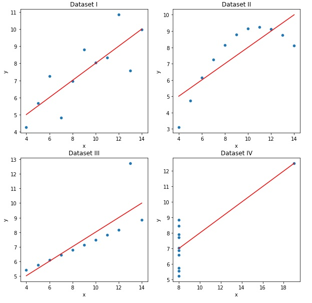
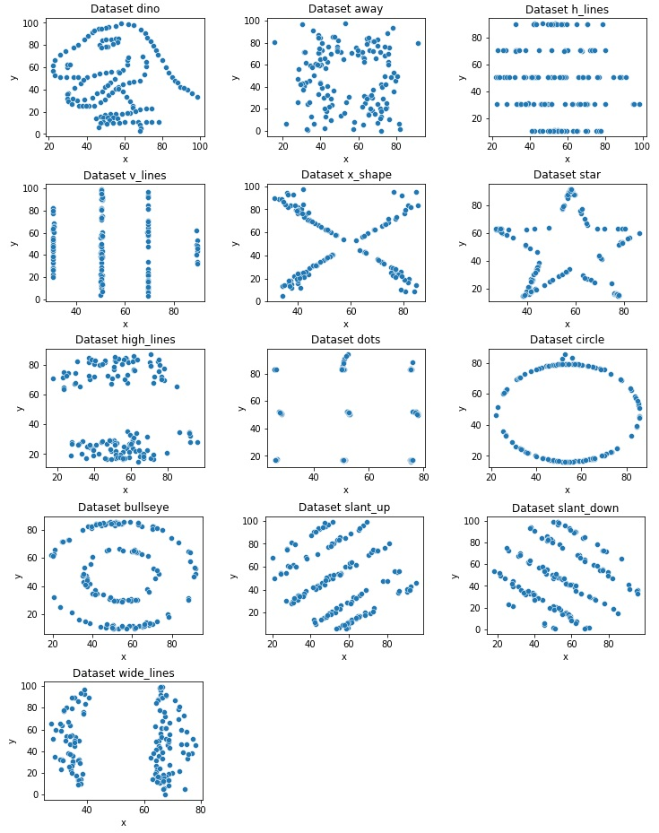
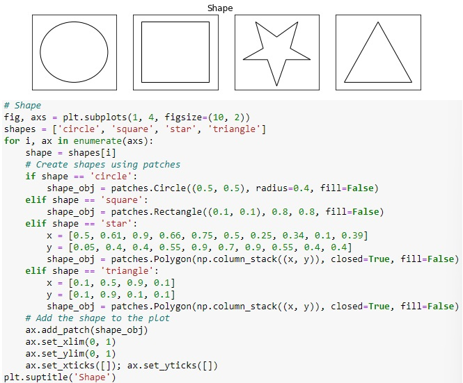
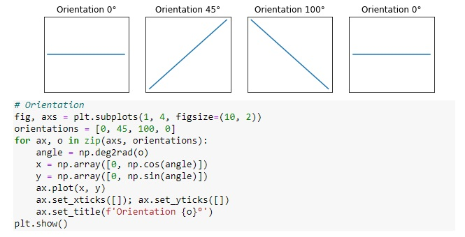
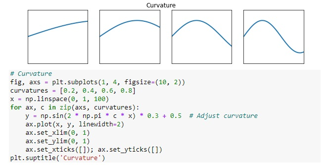
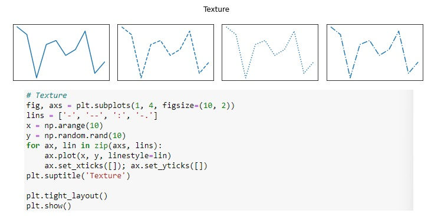
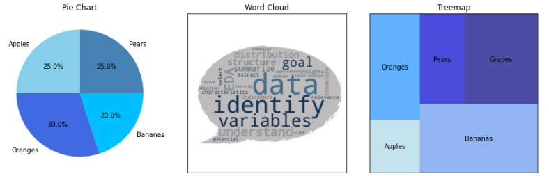
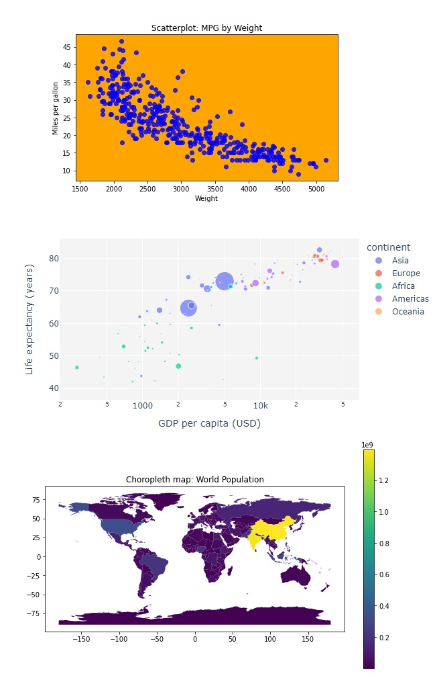
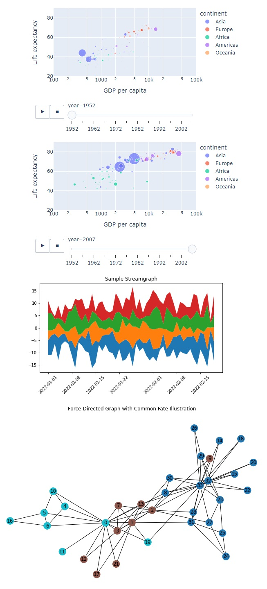

# 4 — Principles of Data Visualization

This module introduces the **principles that govern how humans perceive, interpret, and make sense of visual information**, and how these principles translate into effective data visualizations. While previous modules focused on *what* to compute and summarize, this module focuses on *how to visually communicate data* in a way that supports cognition, reduces misinterpretation, and enables insight.

The concepts presented here provide the perceptual and design foundation for the visualization methods to be explored in subsequent modules.

## Learning Objectives

By the end of this module, students will be able to:

1. Explain how human visual perception affects data interpretation.
2. Distinguish between attentive and preattentive visual processing.
3. Apply Gestalt principles to analyze and design visualizations.
4. Evaluate tables and graphs based on fundamental visualization design principles.
5. Identify common visualization pitfalls and cognitive overload issues.

## 4.1 Visual Processing

Data visualization is fundamentally a **human–computer interaction problem**. Visual representations must align with how the human visual system processes information. Poorly designed visualizations increase cognitive load and obscure patterns, while well-designed ones exploit perceptual strengths.

### 4.1.1 “Can’t See the Forest for the Trees”

This expression captures a frequent problem in data visualization: **excessive detail prevents global understanding**.

Common causes include:

* Too many variables displayed simultaneously
* Excessive annotations, labels, or colors
* Overly granular data without aggregation

The human brain has limited working memory. When visual complexity exceeds this limit, users focus on local details and fail to perceive global structure, trends, or anomalies.

**Design implication:**
Visualization should emphasize *structure before detail*. Aggregation, filtering, and layering are essential strategies to guide attention.

Another important aspect in EDA discussed here is that while summary measures are very useful for the understanding of data, it is usually insufficient for us to have full knowledge of the data distribution. More specifically, it is possible that some data sets present the same summary measures but significantly different structure and distributions. 

To illustrate, consider the case of the Anscombe's Quartet presented in the code snippet and figure below. Despite some structural differences, all datasets have the same summary measures and regression lines.

```python
# CODE 4.1
# Print the Anscombe's Quartet table with the summary measures (mean, std, corr, linear 
# regression) for each dataset and plot the scatterplots of each of the four datasets

import seaborn as sns
import pandas as pd
import numpy as np
import statsmodels.api as sm
import matplotlib.pyplot as plt

# Uses the Seaborn library to load the Anscombe's data 
danscombe = sns.load_dataset("anscombe")
pd.options.display.float_format = "{:.2f}".format

# Print the data and summary measures for each dataset
for dataset in ["I", "II", "III", "IV"]:
    df_subset = danscombe[danscombe.dataset == dataset]
    print(f"Dataset  {dataset}\n{df_subset}")
    print(f"Summary Measures for Dataset {dataset}:")
    print(f"Mean of x: {np.mean(df_subset.x):.2f}")
    print(f"Mean of y: {np.mean(df_subset.y):.2f}")
    print(f"Std of x: {np.std(df_subset.x):.2f}")
    print(f"Std of y: {np.std(df_subset.y):.2f}")
    print(f"Correlation between x and y: {np.corrcoef(df_subset.x, df_subset.y)[0,1]:.2f}")
    model = sm.OLS(df_subset.y, sm.add_constant(df_subset.x)).fit()
    print(f"Linear regression model: y = {model.params.iloc[0]:.2f} + {model.params.iloc[1]:.2f}x\n")

# Plot the scatterplots and regression lines for each dataset
fig, axes = plt.subplots(2, 2, figsize=(10, 10))

for i, dataset in enumerate(["I", "II", "III", "IV"]):
    ax = axes.flatten()[i]
    df_subset = danscombe[danscombe.dataset == dataset]
    x = df_subset.x; y = df_subset.y
    model = sm.OLS(y, sm.add_constant(x)).fit()
    y_pred = model.predict(sm.add_constant(x))
    sns.scatterplot(x=x, y=y, ax=ax)
    sns.lineplot(x=x, y=y_pred, color="red", ax=ax)
    ax.set_title(f"Dataset {dataset}", fontsize=16)

# Save & Show the plot
plt.savefig("Figure_4_1_Anscombe_Quartet.svg", format="svg", dpi=1500)
plt.show()
```

Dataset  I <br>
   dataset     x     y <br>
0        I 10.00  8.04 <br>
1        I  8.00  6.95 <br>
2        I 13.00  7.58 <br>
3        I  9.00  8.81 <br>
4        I 11.00  8.33 <br>
5        I 14.00  9.96 <br>
6        I  6.00  7.24 <br>
7        I  4.00  4.26 <br>
8        I 12.00 10.84 <br>
9        I  7.00  4.82 <br>
10       I  5.00  5.68 <br>
Summary Measures for Dataset I: <br>
Mean of x: 9.00 <br>
Mean of y: 7.50 <br>
Std of x: 3.16 <br>
Std of y: 1.94 <br>
Correlation between x and y: 0.82 <br>
Linear regression model: y = 3.00 + 0.50x <p>

Dataset  II <br>
   dataset     x    y <br>
11      II 10.00 9.14 <br>
12      II  8.00 8.14 <br>
13      II 13.00 8.74 <br>
14      II  9.00 8.77 <br>
15      II 11.00 9.26 <br>
16      II 14.00 8.10 <br>
17      II  6.00 6.13 <br>
18      II  4.00 3.10 <br>
19      II 12.00 9.13 <br>
20      II  7.00 7.26 <br>
21      II  5.00 4.74 <br>
Summary Measures for Dataset II: <br>
Mean of x: 9.00 <br>
Mean of y: 7.50 <br>
Std of x: 3.16 <br>
Std of y: 1.94 <br>
Correlation between x and y: 0.82 <br>
Linear regression model: y = 3.00 + 0.50x <p>

Dataset  III <br>
   dataset     x     y <br>
22     III 10.00  7.46 <br>
23     III  8.00  6.77 <br>
24     III 13.00 12.74 <br>
25     III  9.00  7.11 <br>
26     III 11.00  7.81 <br>
27     III 14.00  8.84 <br>
28     III  6.00  6.08 <br>
29     III  4.00  5.39 <br>
30     III 12.00  8.15 <br>
31     III  7.00  6.42 <br>
32     III  5.00  5.73 <br>
Summary Measures for Dataset III:  <br>
Mean of x: 9.00 <br>
Mean of y: 7.50 <br>
Std of x: 3.16 <br>
Std of y: 1.94 <br>
Correlation between x and y: 0.82 <br>
Linear regression model: y = 3.00 + 0.50x <p>

Dataset  IV <br>
   dataset     x     y <br>
33      IV  8.00  6.58 <br>
34      IV  8.00  5.76 <br>
35      IV  8.00  7.71 <br>
36      IV  8.00  8.84 <br>
37      IV  8.00  8.47 <br>
38      IV  8.00  7.04 <br>
39      IV  8.00  5.25 <br>
40      IV 19.00 12.50 <br>
41      IV  8.00  5.56 <br>
42      IV  8.00  7.91 <br>
43      IV  8.00  6.89 <br>
Summary Measures for Dataset IV: <br>
Mean of x: 9.00 <br>
Mean of y: 7.50 <br>
Std of x: 3.16 <br>
Std of y: 1.94 <br>
Correlation between x and y: 0.82 <br>
Linear regression model: y = 3.00 + 0.50x <p>



### Prompt — Anscombe's Quartet Table with Summary Measures
```
You are a data analysis assistant supporting an **Advanced Exploratory Data Analysis (AEDA)** course.

Your goal is to **perform the descriptive and visual analysis of Anscombe’s Quartet**. This task highlights how datasets with identical summary statistics can exhibit radically different visual patterns.

## Dataset

- Load **Anscombe’s Quartet** using the Seaborn built-in dataset loader.
- Treat the data exactly as provided (no preprocessing or transformations).
- Ensure all numerical outputs are displayed with **two decimal places**.

## Tasks

### Part 1 — Descriptive Summary for Each Dataset

For each dataset, perform the following steps independently:

1. Subset the data to include only the current dataset.
2. Display the full table of `(x, y)` values for that dataset.
3. Compute and report the following **summary measures**:
   - Mean of `x`
   - Mean of `y`
   - Standard deviation of `x`
   - Standard deviation of `y`
   - Pearson correlation coefficient between `x` and `y`
4. Fit a **simple linear regression model** using **ordinary least squares (OLS)**.
5. Report the regression equation using the estimated coefficients.
6. Present all results in a clear, labeled, and readable textual format.

### Part 2 — Visualization

1. Create a single figure composed of a **2 × 2 grid of subplots**.
2. For each dataset (I–IV):
   - Plot a **scatterplot** of `x` versus `y`.
   - Overlay the **corresponding linear regression line**.
   - Assign the subplot title as `Dataset I`, `Dataset II`, etc.
3. Use consistent visual styling across all subplots to allow direct comparison.

## Output Requirements

- Printed output must include:
  - The full table for each dataset
  - All computed summary measures
  - The linear regression equation for each dataset
- The final figure must:
  - Contain four subplots (one per dataset)
  - Clearly show both data points and regression lines
```

An example similar to the **Anscombe’s Quartet** is the **Datasaurus Dozen**, a dataset consisting of 13 distinct datasets, each with a different shape, but with practically the same summary measures. The code snippet below is similar to the previous one, but reads the Datasaurus Dozen dataset from a CSV file with semicolon delimiter using the Pandas library. 

```python
# CODE 4.2
# Print the Datasaurus Dozen table with the summary measures (mean, std, corr, linear 
# regression) and plot the scatterplots of each dataset

import pandas as pd
import numpy as np
import statsmodels.api as sm
import matplotlib.pyplot as plt
import seaborn as sns

# Load the dataset using Pandas
dsaurus = pd.read_csv("datasaurus_dozen.csv", delimiter=';')
pd.options.display.float_format = "{:.2f}".format

# Print the data and summary measures for each dataset
for dataset in dsaurus.dataset.unique():
    print(f"Summary Measures for Dataset {dataset}:")
    df_subset = dsaurus[dsaurus.dataset == dataset]
    print(f"Mean of x: {np.mean(df_subset.x):.2f}")
    print(f"Mean of y: {np.mean(df_subset.y):.2f}")
    print(f"Std of x: {np.std(df_subset.x):.2f}")
    print(f"Std of y: {np.std(df_subset.y):.2f}")
    print(f"Correlation between x and y: {np.corrcoef(df_subset.x, df_subset.y)[0, 1]:.2f}")
    model = sm.OLS(df_subset.y, sm.add_constant(df_subset.x)).fit()
    print(f"Linear regression model: y = {model.params.iloc[0]:.2f} + {model.params.iloc[1]:.2f}x\n")

# Plot the scatterplots for each dataset
fig, axes = plt.subplots(5, 3, figsize=(14, 18))

for i, dataset in enumerate(dsaurus.dataset.unique()):
    ax = axes.flatten()[i]
    df_subset = dsaurus[dsaurus.dataset == dataset]
    x = df_subset.x; y = df_subset.y
    sns.scatterplot(x=x, y=y, ax=ax)
    ax.set_title(f"Dataset {dataset}", fontsize=16)
    
for i in range(len(dsaurus.dataset.unique()), len(axes.flatten())):
    fig.delaxes(axes.flatten()[i])  # Remove unused subplots

# Save & Show the plot
plt.savefig("Figure_4_2_Datasaurus_Dozen.svg", format="svg", dpi=1500)
plt.show()
```

Summary Measures for Dataset dino:  <br>
Mean of x: 54.26 <br>
Mean of y: 47.83  <br>
Std of x: 16.71  <br>
Std of y: 26.84  <br>
Correlation between x and y: -0.06 <br>
Linear regression model: y = 53.45 + -0.10x. <p>

 <p>
**Figure:** Scatterplots of the 13 datasets available in the Datasaurus Dozen.

#### Exercise 1: Create the prompt to plot the summary measures and scatterplots of the Datasauros Dozen.

### 4.1.2 Preattentive Processing

**Preattentive processing** refers to the ability of the human visual system to rapidly and automatically detect certain visual features *before conscious attention is engaged*.

Preattentive attributes include:

* Color (hue, intensity)
* Orientation
* Size
* Shape
* Position
* Motion

These attributes are processed in parallel and enable near-instant detection of patterns such as outliers or clusters.

For example:

* A red dot among gray dots is immediately visible
* A larger bar among equal-sized bars stands out

**Design implication:**
Key variables should be mapped to preattentive attributes when rapid detection is desired.

The code snippet below illustrate various preattentive features: Shape, line width, color, size, markings, orientation, position, 3d, length, curvature, density, closure, and texture.

```python
# CODE SNIPPETS for Section 4.1.2
# Preattemptive Processing
# Code to generate illustrations of the following preattemptive processing:
# Shape, line width, color, size, markings, orientation, position, 3d,  
# length, curvature, density, closure, and texture

import numpy as np
import matplotlib.pyplot as plt
import matplotlib.patches as patches 
from mpl_toolkits.mplot3d import Axes3D

# Shape
fig, axs = plt.subplots(1, 4, figsize=(8, 2), constrained_layout=True)
shapes = ['circle', 'square', 'star', 'triangle']
for i, ax in enumerate(axs):
    shape = shapes[i]
    # Create shapes using patches
    if shape == 'circle':
        shape_obj = patches.Circle((0.5, 0.5), radius=0.4, fill=False)
    elif shape == 'square':
        shape_obj = patches.Rectangle((0.1, 0.1), 0.8, 0.8, fill=False)
    elif shape == 'star':
        x = [0.5, 0.61, 0.9, 0.66, 0.75, 0.5, 0.25, 0.34, 0.1, 0.39]
        y = [0.05, 0.4, 0.4, 0.55, 0.9, 0.7, 0.9, 0.55, 0.4, 0.4]
        shape_obj = patches.Polygon(np.column_stack((x, y)), closed=True, fill=False)
    elif shape == 'triangle':
        x = [0.1, 0.5, 0.9, 0.1]
        y = [0.1, 0.9, 0.1, 0.1]
        shape_obj = patches.Polygon(np.column_stack((x, y)), closed=True, fill=False)
    # Add the shape to the plot
    ax.add_patch(shape_obj)
    ax.set_xlim(0, 1)
    ax.set_ylim(0, 1)
    ax.set_xticks([]); ax.set_yticks([])

# Line Width
fig, axs = plt.subplots(1, 4, figsize=(8, 2), constrained_layout=True)
line_widths = [1, 2, 3, 4]
x = np.arange(10)
y = np.random.rand(10)
for ax, lw in zip(axs, line_widths):
    ax.plot(x, y, linewidth=lw)
    ax.set_xticks([]); ax.set_yticks([])
    #ax.set_title(f'Line width {lw}')

# Color
fig, axs = plt.subplots(1, 4, figsize=(8, 2), constrained_layout=True)
colors = [[1, 0, 0], [0, 1, 0], [0, 0, 1], [1, 1, 0]]
x = np.arange(10)
y = np.random.rand(10)
for ax, c in zip(axs, colors):
    ax.plot(x, y, color=c)
    ax.set_xticks([]); ax.set_yticks([])
    #ax.set_title(f'Color {c}')

# Size
fig, axs = plt.subplots(1, 4, figsize=(8, 2), constrained_layout=True)
sizes = [10, 30, 50, 80]
for ax, s in zip(axs, sizes):
    ax.scatter(np.random.rand(10), np.random.rand(10), s=s)
    ax.set_xticks([]); ax.set_yticks([])

# Markings
fig, axs = plt.subplots(1, 4, figsize=(8, 2), constrained_layout=True)
marks = ['+', 's', 'x', 'o']
x = np.arange(10)
y = np.random.rand(10)
for ax, mark in zip(axs, marks):
    ax.plot(x, y, marker=mark)
    ax.set_xticks([]); ax.set_yticks([])

# Orientation
fig, axs = plt.subplots(1, 4, figsize=(8, 2), constrained_layout=True)
orientations = [0, 45, 135, 0]
for ax, o in zip(axs, orientations):
    angle = np.deg2rad(o)
    x = np.array([0, np.cos(angle)])
    y = np.array([0, np.sin(angle)])
    ax.plot(x, y)
    ax.set_xticks([]); ax.set_yticks([])
    ax.set_title(f'{o}°')

# Position
fig, axs = plt.subplots(1, 4, figsize=(8, 2), constrained_layout=True)
for ax in axs:
    ax.scatter(np.random.rand(10), np.random.rand(10))
    ax.set_xticks([]); ax.set_yticks([])

# 3D
fig = plt.figure()
ax = fig.add_subplot(111, projection='3d')
ax.scatter(np.random.rand(10), np.random.rand(10), np.random.rand(10))
ax.set_xticks([]); ax.set_yticks([]); ax.set_zticks([])

# Length
fig, axs = plt.subplots(1, 4, figsize=(8, 2), constrained_layout=True)
lengths = [0.2, 0.4, 0.6, 0.8]
for ax, l in zip(axs, lengths):
    ax.plot([0, l], [0.5, 0.5], linewidth=2)
    ax.set_xlim(0, 1)
    ax.set_ylim(0, 1)
    ax.set_xticks([]); ax.set_yticks([])

# Curvature
fig, axs = plt.subplots(1, 4, figsize=(8, 2), constrained_layout=True)
curvatures = [0.2, 0.4, 0.6, 0.8]
x = np.linspace(0, 1, 100)
for ax, c in zip(axs, curvatures):
    y = np.sin(2 * np.pi * c * x) * 0.3 + 0.5  # Adjust curvature
    ax.plot(x, y, linewidth=2)
    ax.set_xlim(0, 1)
    ax.set_ylim(0, 1)
    ax.set_xticks([]); ax.set_yticks([])

# Density
fig, axs = plt.subplots(1, 4, figsize=(8, 2), constrained_layout=True)
densities = [10, 50, 100, 500]
for ax, d in zip(axs, densities):
    x = np.random.rand(d)
    y = np.random.rand(d)
    ax.scatter(x, y, alpha=0.5)
    ax.set_xticks([]); ax.set_yticks([])
    #ax.set_title(f'Density {d}')

# Closure
fig, axs = plt.subplots(1, 4, figsize=(8, 2), constrained_layout=True)
for i, ax in enumerate(axs):
    x = [0, 1, 1, 0, 0][:i+2]
    y = [0, 0, 1, 1, 0][:i+2]
    ax.plot(x, y, '-o')
    # adjust scale of plot
    ax.set_xlim([-0.25, 1.25]), ax.set_ylim([-0.25, 1.25])
    ax.set_xticks([]); ax.set_yticks([])

# Texture
fig, axs = plt.subplots(1, 4, figsize=(8, 2), constrained_layout=True)
lins = ['-', '--', ':', '-.']
x = np.arange(10)
y = np.random.rand(10)
for ax, lin in zip(axs, lins):
    ax.plot(x, y, linestyle=lin)
    ax.set_xticks([]); ax.set_yticks([])
plt.show()
```

The figures below show the thirteen preattentive features discussed here followed by the portions of the code snippets that generated them. The code to generated all of them at once was presented above.












### Prompt — Preattentive Processing Features
```
You are a data analysis assistant supporting an **Advanced Exploratory Data Analysis (AEDA)** course.

Your goal is to generate a complete set of **Python illustrations of preattentive processing attributes**. The output must consist of multiple figures (mostly 1×4 subplot layouts) demonstrating how different visual encodings are perceived preattentively.

## Tasks — Generate Figures for Preattentive Attributes

Create the figures below each as a separate figure.

### 1) Shape (patch-based)
Create a 1×4 figure showing, in order:
- Circle, Square, Star, Triangle

### 2) Line Width
Create a 1×4 figure demonstrating different line widths:
- `line_widths = [1, 2, 3, 4]`

### 3) Color
Create a 1×4 figure demonstrating different line colors:
- `colors = [[1,0,0], [0,1,0], [0,0,1], [1,1,0]]`

### 4) Size
Create a 1×4 figure demonstrating marker size in scatterplots:
- `sizes = [10, 30, 50, 80]`

### 5) Markings
Create a 1×4 figure demonstrating different markers on a line plot:
- `marks = ['+', 's', 'x', 'o']`
```

The table below summarizes the preattentive features and how each one of them enables us to identify and differentiate visual elements.

**Table:** Summary of the preattentive features reviewed and their descriptions.
| Preattentive Feature | Description |
|---------------------|-------------|
| Shape | Enables effortless and automatic detection of similarities and differences based on form. |
| Line Width | Allows the rapid identification of variations in thickness within a group of similar lines. |
| Color | Utilizes encoding to convey data, including categories, magnitude, visual hierarchy, and emotions. |
| Size | Facilitates quick and automatic detection of differences in items, similar to the effect of line width. |
| Markings | Allows swift detection of differences and similarities, such as the identification of repeating patterns among random shapes. |
| Orientation | Assists in item differentiation and extraction of information from data points, lines, objects, etc. |
| Position | Allows swift detection of location changes, such as the displacement of an item or object. |
| 3D | Enables the perception of depth and spatial relationships without focused attention. |
| Length | Creates visual contrast, differences, importance, and proportions. |
| Curvature | Allows the rapid detection of changes in shape curvature, bending, or angularity. |
| Density | Utilized in visual communication for contrast and emphasis on importance or relevance. |
| Closure | Relates to our ability to mentally complete an incomplete object or shape. |
| Texture | Pertains to the visual quality of objects, including roughness, pattern, and smoothness, enabling fast distinction among them. |

### 4.1.3 Gestalt Principles and Data Visualization Methods

Gestalt psychology explains how humans naturally group visual elements. These principles are critical in visualization design.

Key Gestalt principles include:

- **Continuity**: The eye follows smooth paths and trends.
- **Closure**: Incomplete shapes are perceived as complete.
- **Proximity**: Elements close to each other are perceived as related.
- **Similarity**: Elements sharing color, shape, or size are grouped together.
- **Symmetry**: Symmetric objects tend to be perceived as a group or pattern.
- **Figure–ground**: Objects are distinguished from their background.
- **Common Fate**: Objects that move together or change in a similar way tend to be perceived as a group or a pattern.

**Design implication:**
Effective visualizations intentionally leverage these principles to encode relationships without explicit annotation.

The figures below show the seven Gestalt principles discussed here.








The table below summarizes the Gestalt principles and how each one of them enables us to encode relationships.without explicit anotation

**Table:** Summary of the gestalt principles reviewed and their descriptions.
| Gestalt Principle | Description |
|-------------------|-------------|
| Continuity | Objects that are arranged in a smooth, continuous way are more likely to be perceived as a single object, even if their pattern is interrupted. |
| Closure | Incomplete objects are perceived as complete because our brain tends to fill the gaps to create the complete image. |
| Proximity | Objects that are close to one another tend to be perceived as a group or a pattern. |
| Similarity | Objects that share similar characteristics, such as color or form, tend to be perceived as a group or a pattern. |
| Symmetry | Objects that are symmetrical, or that have a balanced appearance, tend to be perceived as a group or a pattern. |
| Figure–Ground | Objects are perceived as either being in the foreground or the background. |
| Common Fate | Objects that move together or change in a similar way tend to be perceived as a group or a pattern. |

#### Exercise 2: Generate Python scripts to illustrate each of the seven Gestalt principles reviewd.

#### Exercise 3: For each Python script create a prompt to illustrate the same principle using a general-purpose LLM.

## 4.2 Design Principles for Data Visualization

Beyond perception, visualization requires **design discipline**. Design principles ensure clarity, accuracy, and interpretability.

Core principles include:

* Simplicity
* Consistency
* Accuracy
* Integrity of scales
* Appropriate encoding

---

### 4.2.1 Tables

Tables are precise but cognitively demanding. They are best suited for:

* Exact values
* Lookup tasks
* Small to medium datasets

**Design guidelines for tables:**

* Align numbers by decimal place
* Use consistent units
* Avoid unnecessary gridlines
* Use whitespace to separate logical groups
* Order rows and columns meaningfully

Tables should support comparison *only when visual alternatives are insufficient*.

---

### 4.2.2 Graphs

Graphs leverage visual perception to reveal patterns, trends, and relationships.

Effective graph design requires:

* Choosing the correct chart type for the data
* Proper scaling (avoiding misleading axes)
* Clear labeling and legends
* Minimal chart junk

Common graph categories include:

* Distribution (histograms, boxplots)
* Association (scatterplots, heatmaps)
* Comparison (bar charts)
* Composition (pie charts, treemaps)
* Temporal evolution (line charts)

**Design implication:**
The same dataset can produce radically different interpretations depending on the chosen visualization.

---

## Reflection

* How does visual perception constrain what can be effectively communicated?
* Which preattentive attributes are most effective for highlighting anomalies?
* When should tables be preferred over graphs?
* How can Gestalt principles reduce the need for explicit explanation?

---

## Further Reading

Students are encouraged to consult the bibliography listed in the course syllabus, particularly the references on data visualization, storytelling, and perceptual foundations.
