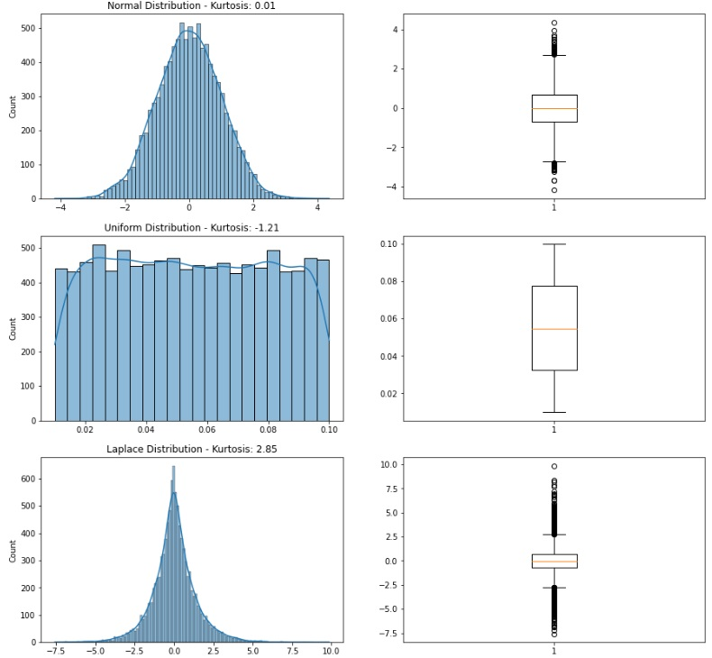
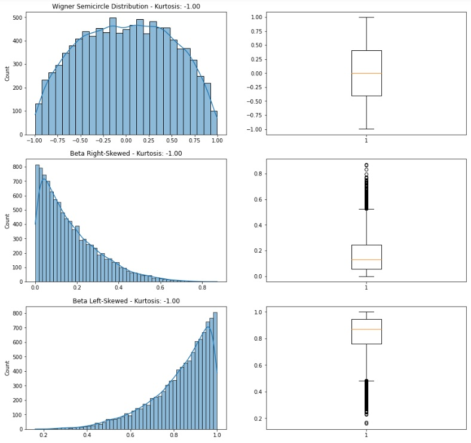
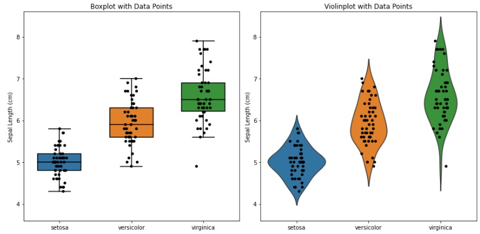

# 5 — Data Visualization Methods

This module presents the **main data visualization methods used in Advanced Exploratory Data Analysis (AEDA)**. While Module 4 focused on *principles* of visualization, this module focuses on *methods*: which visual representations to use depending on the analytical goal and the nature of the data.

The methods are organized according to the analytical questions they help answer: **distributions, associations, amounts, proportions, evolution and flow, and geospatial data**.

## Learning Objectives

By the end of this module, students will be able to:

1. Select appropriate visualization methods based on data type and analytical goal.  
2. Interpret distributions, associations, and patterns using visual representations.  
3. Compare variables using appropriate quantitative and categorical charts.  
4. Analyze temporal evolution, flows, and spatial patterns visually.  
5. Avoid common misuses of visualization methods in exploratory analysis.

## 5.1 Visualization Selection Guide

This program adopts a categorization of visualization methods that considers the type of data and visualization generated by the graphs, as follows:
- **Distribution**: Distribution graphs are used to show how the values of a variable are spread across their range. They help us understand the shape, center, variability, and presence of outliers in the data. Common examples include histograms, boxplots, and violin plots.
- **Associations**: Association graphs are used to visualize relationships between two or more variables. They allow us to explore patterns, trends, correlations, clusters, and anomalies in the data. Typical examples include scatter plots, scatterplot matrices, heatmaps, correlograms, and bubble charts.
- **Amounts**: Amount graphs are used to compare the magnitude of values across categories or variables. They are useful for identifying differences and rankings. Examples include bar charts, radar charts, and word clouds.
- **Proportions**: Proportion graphs show how a whole is divided into parts based on their relative contribution. These visualizations emphasize percentages or shares rather than absolute values. Common examples include pie charts, doughnut charts, treemaps, sunburst charts, and dendrograms.
- **Evolution and Flow**: Evolution graphs are used to represent how numeric values change over time, while flow graphs illustrate movement or transitions between stages or categories. Examples include line charts, area charts, Sankey diagrams, and Gantt charts.
- **Geospatial**: Geospatial graphs are used to visualize data associated with geographic locations. They help identify spatial patterns and regional differences. Typical examples include choropleth maps and bubble maps.

 <p>
**Figure:** Categories of data visualization methods.

Use the table below as a **quick guide** to select a visualization method based on the analytical question, the data type, and the main interpretation goal.

| Analytical goal | Typical data | Recommended charts | Best for | Common pitfalls |
|---|---|---|---|---|
| **Understand a distribution** | 1 quantitative variable (continuous) | Histogram, Boxplot, Violin | Shape, spread, skewness, outliers | Too many bins / too few bins; hiding outliers via axis truncation |
| **Compare distributions across groups** | 1 quantitative + 1 categorical | Boxplot, Violin | Group comparison, outliers, multimodality | Ignoring sample size per group; overplotting with too many categories |
| **Study association (2 variables)** | 2 quantitative variables | Scatter plot | Direction, strength, clusters, outliers | Overplotting; using lines for unordered categories |
| **Study association (3–4 variables)** | 2 quantitative + size (quant) + color (cat/quant) | Bubble chart | Multivariate patterns at a glance | Misleading area encoding; hard comparisons when bubble sizes vary too much |
| **Inspect many pairwise associations** | Many quantitative variables | Pair plot (scatterplot matrix) | Correlation patterns and anomalies | Too many variables → clutter; interpreting correlation as causation |
| **Summarize a matrix of values** | Tabular matrix / correlation matrix | Heatmap, Correlogram | Patterns in matrices, correlation structure | Poor colormap choice; not centering correlations at 0; missing annotation/scale |
| **Compare amounts across categories** | Categorical + quantitative | Bar chart | Clear magnitude comparisons | Unsorted bars; too many categories; truncated axes |
| **Compare profiles across dimensions** | Multiple quantitative variables per entity | Radar chart (careful) | Quick “profile” shape comparison | Difficult precise comparison; poor for many entities; scale differences distort shape |
| **Show parts of a whole** | Categorical proportions | Pie/Doughnut (few categories), Treemap (many/hierarchical) | Share of total, hierarchy | Too many slices; comparing angles is hard; hiding small values |
| **Show evolution over time** | Time series | Line chart | Trend, seasonality, change points | Smoothing hides structure; missing time aggregation; too many lines |
| **Show flows between stages** | Source → target with amounts | Sankey chart | Movement of quantities | Too many nodes/links; ordering issues; hard to read without grouping |
| **Show project schedule** | Tasks with start/end dates | Gantt chart | Task duration and overlap | Too many tasks without grouping; missing dependencies/context |
| **Show spatial variation by region** | Geographic polygons + numeric value | Choropleth map | Regional intensity patterns | Mapping counts instead of rates; class breaks/scale choices mislead |
| **Show spatial quantities at points** | Geographic points + numeric value | Bubble map | Location-based magnitude | Bubble overlap; area vs radius confusion; missing basemap context |

## 5.1 Distributions

Distribution plots are used to **understand how values of a variable are spread across their range**, including shape, center, variability, and outliers.

### 5.1.1 Histogram

**Purpose:**  
To explore and visualize the distribution of a single variable.

**Common type of data:**  
Continuous quantitative data.

**Interpretation:**  
The histogram divides the data range into bins and displays the frequency (absolute or relative) of values in each bin. Interpretation focuses on:
- Shape (symmetric, skewed, multimodal)
- Central tendency
- Spread
- Presence of gaps and outliers

### 5.1.2 Boxplot (Box-and-Whisker Plot)

**Purpose:**  
To visualize and compare distributions using the **five-number summary**.

**Common type of data:**  
Continuous quantitative data.

**Five-number summary:**  
- Minimum  
- First quartile $Q_1$  
- Median $Q_2$  
- Third quartile $Q_3$  
- Maximum  

**Outlier detection:**  
Values are often considered outliers if <p>
$x < Q_1 - \gamma \cdot IQR \quad \text{or} \quad x > Q_3 + \gamma \cdot IQR$ <p>
where $IQR = Q_3 - Q_1$ and typically $\gamma = 1.5$.

#### Python Code — Boxplot and Histogram

```python
# CODE 5.1
# Box plot and histogram for a normal distribution

import matplotlib.pyplot as plt
import numpy as np
import scipy.stats as spy
import seaborn as sns

# Generate the random sample data
np.random.seed()
data = np.random.normal(loc=0, scale=1, size=1000)

# Calculate the summary measures
q1, q2, q3 = np.percentile(data, [25, 50, 75])
iqr = q3 - q1
upper_whisker = q3 + 1.5*iqr; lower_whisker = q1 - 1.5*iqr
max_val = np.max(data); min_val = np.min(data)
midpoint = (max_val+min_val)/2
k = spy.kurtosis(data); s = spy.skew(data)

# Plot the boxplot and print the values (Q1, Q2, Q3) on the first subplot
fig, (ax1, ax2) = plt.subplots(nrows=1, ncols=2, figsize=(10,5))
bp = ax1.boxplot(data)
ax1.set_title(f"IQR: {iqr:.2f}", fontsize=16)
ax1.text(0.9, q1, f'Q1: {q1:.2f}', ha='right', va='center', fontsize=14)
ax1.text(0.9, q2, f'Q2: {q2:.2f}', ha='right', va='center', fontsize=14)
ax1.text(0.9, q3, f'Q3: {q3:.2f}', ha='right', va='center', fontsize=14)

# Plot the histogram on the second subplot
sns.histplot(data, bins='auto', ax=ax2)
plt.axvline(x=upper_whisker, color='k', linestyle=':')
plt.axvline(x=lower_whisker, color='k', linestyle=':')

plt.title(f"Kurtosis: {k:.2f},  Skewness: {s: .2f}")
plt.show()
```


#### Prompt — Boxplot and Histogram
```
You are a data visualization assistant supporting an **Advanced Exploratory Data Analysis (AEDA)** course.

Your task is to **illustrate the distribution of a continuous variable drawn from a normal distribution** using complementary visualizations.

### High-Level Objectives

1. Generate a synthetic dataset that follows a **normal (Gaussian) distribution**.
2. Visually analyze the distribution using **two side-by-side plots**:
   - A **box-and-whisker plot** to summarize the distribution using quartiles and dispersion.
   - A **histogram** to show the overall shape and frequency of values.
3. Ensure the two plots are presented **in the same figure**, allowing direct comparison between:
   - Numerical summary information (via the boxplot), and
   - Distributional shape (via the histogram).
4. Clearly communicate key characteristics of the distribution, including:
   - Central tendency and spread (via quartiles and IQR),
   - Potential outliers (via whiskers),
   - Shape-related properties such as **skewness** and **kurtosis**.
5. Annotate the visualizations so that a student can easily interpret:
   - The quartile values in the boxplot, and
   - Distributional properties in the histogram.

### Expected Outcome

Produce a single figure with:
- A **boxplot** highlighting quartiles and interquartile range.
- A **histogram** showing the distribution of the same data.
- Informative titles and annotations that reinforce how summary statistics and visual structure complement each other in exploratory data analysis.

The emphasis should be on **conceptual clarity and interpretability**, not on implementation details or low-level plotting mechanics.
```


> **Note:** In this module we are going to use a different style of prompts when compared with the prompts developed in the previous module. This is to illustrate that although we keep the general structure of the prompt, it is possible to create them in different ways and obtain similar (equivalent) results.

<!--


-->
---

### 5.1.3 Violin Plot

**Purpose:**  
To visualize distributions by combining a boxplot with a **kernel density estimate**.

**Common type of data:**  
Continuous quantitative data.

**Interpretation:**  
- Width represents data density  
- Shape reveals multimodality and skewness  
- Inner quartiles and median can be shown as in a boxplot

#### Python Code — Box and Violin plot (Iris dataset example)

```python
# CODE 5.2
# Comparing the Box and Violin plots for the Sepal length of
# the Iris dataset grouped by plant species

import seaborn as sns
import matplotlib.pyplot as plt
from sklearn.datasets import load_iris

# Load the Iris dataset
diris = load_iris()
fig, axs = plt.subplots(nrows=1, ncols=2, figsize=(12, 6))

# Boxplot with data points
sns.boxplot(x=diris.target, y=diris.data[:, 0], ax=axs[0], width=0.6,
            boxprops=dict(edgecolor='black'),
            whiskerprops=dict(color='black', linestyle='-'),
            medianprops=dict(color='black'),
            capprops=dict(color='black', linestyle='-'))
sns.stripplot(x=diris.target, y=diris.data[:, 0], ax=axs[0], color='black')
axs[0].set_xticks([0, 1, 2])
axs[0].set_xticklabels(diris.target_names)
axs[0].set_ylabel('Sepal Length (cm)')
axs[0].set_ylim([3.6, 8.6])
axs[0].set_title('Boxplot with Data Points')

# Violinplot with data points
sns.violinplot(x=diris.target, y=diris.data[:, 0], ax=axs[1], inner=None)
sns.stripplot(x=diris.target, y=diris.data[:, 0], ax=axs[1], jitter=True, color='black')
axs[1].set_xticks([0, 1, 2])
axs[1].set_xticklabels(diris.target_names)
axs[1].set_ylabel('Sepal Length (cm)')
axs[1].set_ylim([3.6, 8.6])
axs[1].set_title('Violinplot with Data Points')

# Show plot
plt.tight_layout()
plt.show()
```

 <p>
**Figure:** Boxplots (a) and violin plots (b) of the Iris dataset sepal length grouped by the plant species.

#### Prompt — Box and Violin plot (Iris dataset example)

```
You are a data visualization assistant supporting an **Advanced Exploratory Data Analysis (AEDA)** course.

Your task is to **compare two complementary distribution visualizations for the same variable across multiple groups** using a well-known benchmark dataset.

## High-Level Objectives

1. Use a standard multivariate dataset containing **continuous measurements and categorical group labels**.
2. Focus on a **single continuous variable** and compare its distribution across **three distinct categories**.
3. Create a **single figure with two side-by-side panels**:
   - A **box-and-whisker plot** to summarize each group using quartiles, dispersion, and potential outliers.
   - A **violin plot** to represent the full distribution shape and density for each group.
4. Overlay **individual data points** on both visualizations to reveal sample size, variability, and potential clustering within each group.
5. Ensure both plots:
   - Share the same vertical scale to allow direct visual comparison,
   - Clearly label groups and measurement units,
   - Highlight how different visualization methods emphasize different aspects of the same data.

## Expected Outcome

Produce a single, well-organized figure that:
- Displays a **boxplot with data points** for the chosen variable, grouped by category.
- Displays a **violin plot with data points** for the same variable and groups.
- Enables students to visually compare:
  - Summary statistics versus distribution shape,
  - Group differences in central tendency and variability,
  - The added value of combining summary-based and density-based visualizations in exploratory data analysis.

The emphasis should be on **conceptual understanding and interpretability**, not on implementation details or low-level plotting mechanics.
```

## 5.2 Associations

Association plots visualize **relationships between two or more variables**.

### 5.2.1 Scatter Plot

**Purpose:**  
To visualize the relationship between two variables.

**Common type of data:**  
Continuous variables on both axes.

**Interpretation:**  
- Direction (positive, negative, none)  
- Strength of association  
- Clusters and outliers  

#### Python Code — Scatter plot with regression line (Auto MPG example)

```python
# CODE 5.3
# Scatter plot for association between two quantitative variables

import pandas as pd
import seaborn as sns
import matplotlib.pyplot as plt
from ucimlrepo import fetch_ucirepo

# Load dataset (UCI: Auto MPG)
dauto = fetch_ucirepo(id=9)["data"]["original"]

plt.figure(figsize=(8, 5))
sns.scatterplot(data=dauto, x="weight", y="mpg", alpha=0.7)
sns.regplot(data=dauto, x="weight", y="mpg", scatter=False)
plt.title("Scatter Plot: mpg vs. weight (Auto MPG)")
plt.xlabel("weight")
plt.ylabel("mpg")
plt.tight_layout()

plt.show()
```


#### Python Code — Scatter plot with regression line (Auto MPG example)

```
You are a data visualization assistant supporting an **Advanced Exploratory Data Analysis (AEDA)** course.

Your task is to **explore and communicate the association between two quantitative variables** using an appropriate visualization technique.

## High-Level Objectives

1. Use a real-world dataset containing **numerical measurements** for multiple variables.
2. Select **two continuous quantitative variables** that are expected to exhibit a meaningful relationship.
3. Create a **scatter plot** to visualize how one variable changes with respect to the other.
4. Enhance the visualization by including a **trend indicator** that helps summarize the overall direction and strength of the relationship.
5. Ensure the visualization clearly supports interpretation by:
   - Labeling axes with meaningful variable names and units,
   - Using transparency or visual cues to reduce overplotting,
   - Including an informative title that describes the relationship being analyzed.

## Expected Outcome

Produce a single, clear figure that:
- Displays a **scatter plot** representing the relationship between two quantitative variables,
- Includes a visual indication of the **overall trend** in the data,
- Allows students to visually assess:
  - Direction of association (positive or negative),
  - Strength and form of the relationship,
  - Presence of clusters or outliers.

The emphasis should be on **conceptual understanding of variable association and visual interpretation**, rather than on implementation details or low-level plotting mechanics.
```

### 5.2.2 Bubble Chart

### 5.2.2 Bubble Chart

**Purpose:**  
To visualize the relationship between **two quantitative variables**, while incorporating an additional quantitative dimension through **bubble size** (and optionally a categorical or quantitative dimension through color).

**Common type of data:**  
- x-axis: continuous quantitative variable  
- y-axis: continuous quantitative variable  
- bubble size: quantitative variable representing magnitude  
- bubble color (optional): categorical groups or quantitative intensity  

**Interpretation:**  
- Direction and strength of association between the two main variables  
- How the third variable varies across the x–y space, as indicated by bubble size  
- Group patterns or segmentation when color is used  
- Presence of clusters, gaps, and outliers, including unusually large or small bubbles  

#### Python Code — Bubble chart (Gapminder dataset example)

```python
# CODE 5.3
# Bubble charts with four variables for the Gapminder and Auto MPG datasets

import pandas as pd
import matplotlib.pyplot as plt
import seaborn as sns

# Load the Gapminder dataset
dgapminder = pd.read_csv('gapminder.csv')

# Filter out missing values in 'lifeExp', 'hdi_index', and 'co2_consumption'
dgapminder = dgapminder.dropna(subset=['life_exp', 'hdi_index', 'co2_consump'])

# Set plot features
sns.set_style("whitegrid")
fig, (ax1, ax2) = plt.subplots(nrows=2, ncols=1, figsize=(10, 13))

# Create a bubble chart for the Gapminder dataset
sns.scatterplot(data=dgapminder, x="hdi_index", y="life_exp", hue="continent", 
                size="co2_consump", sizes=(20, 500), alpha=0.7, ax=ax1)
ax1.set_xlabel("HDI Index", fontsize=14, labelpad=6.0)
ax1.set_ylabel("Life Expectancy", fontsize=14, labelpad=6.0)
ax1.set_title("Life Expectancy vs HDI Index by Continent (Bubble size is CO2 Consumption)", fontsize=16, pad=15.0)
ax1.legend(bbox_to_anchor=(1.05, 1), loc=2, borderaxespad=0.)

# Create a bubble chart for the Auto MPG dataset
dmpg = pd.read_csv('mpg.csv')
sns.scatterplot(data=dmpg, x="acceleration", y="mpg", hue="cylinders", 
                size="horsepower", sizes=(20, 500), alpha=0.7, ax=ax2)
ax2.set_xlabel("Acceleration", fontsize=14, labelpad=6.0)
ax2.set_ylabel("MPG", fontsize=14, labelpad=6.0)
ax2.set_title("MPG vs Acceleration by Cylinders (Bubble size represents HP)", fontsize=16, pad=15.0)
ax2.legend(bbox_to_anchor=(1.05, 1), loc=2, borderaxespad=0.)

# Adjust the layout to add space between subplots
plt.subplots_adjust(hspace=0.3)
plt.show()
```


#### Prompt — Bubble chart (Gapminder dataset example)

```
You are a data visualization assistant supporting an **Advanced Exploratory Data Analysis (AEDA)** course.

Your task is to **analyze multivariate relationships using bubble charts**, where multiple variables are encoded simultaneously in a single visualization.

## High-Level Objectives

1. Use two real-world datasets containing **continuous and categorical variables** from different application domains.
2. For each dataset, select **four variables** and encode them visually as follows:
   - Two continuous variables mapped to the **x-axis** and **y-axis**,
   - One quantitative variable represented by **bubble size**,
   - One categorical variable represented by **color**.
3. Create a **single figure composed of two vertically stacked bubble charts**, one for each dataset, to allow comparison across contexts.
4. Ensure each bubble chart:
   - Clearly communicates the relationship between the two main quantitative variables,
   - Uses bubble size to convey an additional magnitude-related dimension,
   - Uses color to distinguish categories or groups.
5. Include clear axis labels, legends, and titles that explicitly explain:
   - What variables are being compared,
   - What bubble size and color represent,
   - How to interpret the visual encoding.

## Expected Outcome

Produce a single, well-organized figure containing:
- A **bubble chart** illustrating relationships among four variables for the first dataset,
- A second **bubble chart** illustrating relationships among four variables for a different dataset,
- Legends and titles that make the multivariate encoding explicit.

The resulting visualizations should allow students to:
- Explore complex multivariate relationships at a glance,
- Compare patterns, clusters, and outliers across groups,
- Understand how bubble charts extend scatter plots by incorporating additional dimensions.

The emphasis should be on **conceptual understanding of multivariate visualization and interpretability**, not on implementation details or low-level plotting mechanics.
```

---

### 5.2.3 Scatterplot Matrix (Pair Plot)

**Purpose:**  
To visualize pairwise relationships among multiple variables.

#### Python Code — Pair plot (Iris example)

```python
# CODE 5.6
# Scatterplot matrix (pair plot) for multivariate association inspection

import seaborn as sns
import matplotlib.pyplot as plt

iris = sns.load_dataset("iris")

g = sns.pairplot(iris, hue="species", diag_kind="hist")
g.fig.suptitle("Pair Plot (Scatterplot Matrix): Iris", y=1.02)

# Save placeholder (note: pairplot is a figure-level object)
g.fig.savefig("./Data/Fig5_6.png", dpi=300, bbox_inches="tight")
plt.show()
```


---

### 5.2.4 Heatmaps and Correlograms

**Purpose:**  
To visualize magnitude (often correlation) using color intensity.

#### Python Code — Correlation heatmap (Iris example)

```python
# CODE 5.7
# Heatmap for correlation matrix (Correlogram)

import seaborn as sns
import matplotlib.pyplot as plt

iris = sns.load_dataset("iris")
corr = iris.drop(columns=["species"]).corr()

plt.figure(figsize=(7, 5))
sns.heatmap(corr, annot=True, cmap="coolwarm", center=0)
plt.title("Correlation Heatmap (Iris)")
plt.tight_layout()

plt.savefig("./Data/Fig5_7.png", dpi=300)
plt.show()
```


---

## 5.3 Amounts

Amount plots compare **absolute magnitudes across categories**.

### 5.3.1 Bar Chart

**Purpose:**  
To compare quantities across discrete categories.

#### Python Code — Bar chart (Forest Fires: counts by month)

```python
# CODE 5.8
# Bar chart for counts across categories

import pandas as pd
import matplotlib.pyplot as plt
from ucimlrepo import fetch_ucirepo

dforest = fetch_ucirepo(id=162)["data"]["original"]

counts = dforest["month"].value_counts().sort_index()

plt.figure(figsize=(10, 5))
plt.bar(counts.index, counts.values)
plt.title("Bar Chart: Number of Records by Month (Forest Fires)")
plt.xlabel("Month")
plt.ylabel("Count")
plt.tight_layout()

plt.savefig("./Data/Fig5_8.png", dpi=300)
plt.show()
```


---

### 5.3.2 Radar Chart

**Purpose:**  
To compare multiple variables for one or more entities.

> Radar charts should be used with care. They can be useful for a quick “profile” view, but they are not ideal for precise comparisons.

#### Python Code — Radar chart (simple example)

```python
# CODE 5.9
# Radar chart (profile comparison) using Plotly

import pandas as pd
import plotly.express as px

df = pd.DataFrame({
    "Metric": ["Accuracy", "Speed", "Cost", "Interpretability", "Robustness"],
    "Model A": [0.85, 0.70, 0.60, 0.75, 0.80],
    "Model B": [0.80, 0.85, 0.55, 0.60, 0.78],
})

df_long = df.melt(id_vars="Metric", var_name="Model", value_name="Score")

fig = px.line_polar(
    df_long,
    r="Score",
    theta="Metric",
    color="Model",
    line_close=True,
    title="Radar Chart: Profile Comparison (Example)"
)
fig.write_image("./Data/Fig5_9.png", scale=2)
fig.show()
```


---

## 5.4 Proportions

Proportion plots show **how a whole is divided into parts**.

### 5.4.1 Pie Chart

**Purpose:**  
To visualize proportions of a whole (best with few categories).

#### Python Code — Pie chart (Mammographic: distribution of Shape, including missing)

```python
# CODE 5.10
# Pie chart for proportions (few categories)

import pandas as pd
import matplotlib.pyplot as plt
from ucimlrepo import fetch_ucirepo

dmammo = fetch_ucirepo(id=161)["data"]["original"]

# Include missing values
shape = dmammo["Shape"].astype("object").fillna("?")
counts = shape.value_counts(dropna=False)

plt.figure(figsize=(7, 7))
plt.pie(counts.values, labels=counts.index.astype(str), autopct="%1.1f%%")
plt.title("Pie Chart: Shape Distribution (Mammographic Mass)")
plt.tight_layout()

plt.savefig("./Data/Fig5_10.png", dpi=300)
plt.show()
```


---

### 5.4.2 Doughnut Chart

**Purpose:**  
A variation of the pie chart with a hollow center.

#### Python Code — Doughnut chart (Matplotlib)

```python
# CODE 5.11
# Doughnut chart using Matplotlib

import matplotlib.pyplot as plt

labels = ["A", "B", "C", "D"]
values = [40, 30, 20, 10]

fig, ax = plt.subplots(figsize=(7, 7))
wedges, texts, autotexts = ax.pie(values, labels=labels, autopct="%1.1f%%", startangle=90)
centre_circle = plt.Circle((0, 0), 0.60, fc="white")
fig.gca().add_artist(centre_circle)

ax.set_title("Doughnut Chart (Example)")
plt.tight_layout()

plt.savefig("./Data/Fig5_11.png", dpi=300)
plt.show()
```


---

### 5.4.3 Treemap

**Purpose:**  
To visualize hierarchical proportions, especially when there are many categories.

#### Python Code — Treemap (Plotly)

```python
# CODE 5.12
# Treemap for hierarchical proportions

import plotly.express as px

df = px.data.gapminder().query("year == 2007")

fig = px.treemap(
    df,
    path=["continent", "country"],
    values="pop",
    title="Treemap: Population by Continent and Country (2007)"
)
fig.write_image("./Data/Fig5_12.png", scale=2)
fig.show()
```


---

## 5.5 Evolution and Flow

These plots show **change over time** or **movement between states**.

### 5.5.1 Line Chart

**Purpose:**  
To visualize trends and temporal evolution.

#### Python Code — Line chart (time series example)

```python
# CODE 5.13
# Line chart for time series evolution

import pandas as pd
import matplotlib.pyplot as plt

# Example time series (replace with a course dataset when available)
df = pd.DataFrame({
    "date": pd.date_range("2025-01-01", periods=12, freq="MS"),
    "value": [12, 15, 14, 18, 20, 19, 22, 25, 23, 21, 24, 27]
})

plt.figure(figsize=(10, 4))
plt.plot(df["date"], df["value"], marker="o")
plt.title("Line Chart: Evolution Over Time (Example)")
plt.xlabel("Date")
plt.ylabel("Value")
plt.tight_layout()

plt.savefig("./Data/Fig5_13.png", dpi=300)
plt.show()
```


---

### 5.5.2 Sankey Chart

**Purpose:**  
To visualize flows between stages or categories (source → target).

#### Python Code — Sankey chart (Plotly)

```python
# CODE 5.14
# Sankey diagram for flow visualization

import plotly.graph_objects as go

labels = ["Source A", "Source B", "Stage 1", "Stage 2", "Outcome X", "Outcome Y"]
source = [0, 1, 2, 2, 3]
target = [2, 2, 3, 4, 5]
value  = [10, 15, 12, 13, 9]

fig = go.Figure(data=[go.Sankey(
    node=dict(label=labels),
    link=dict(source=source, target=target, value=value)
)])

fig.update_layout(title_text="Sankey Chart (Example)", font_size=12)
fig.write_image("./Data/Fig5_14.png", scale=2)
fig.show()
```


---

### 5.5.3 Gantt Chart

**Purpose:**  
To visualize tasks over time.

#### Python Code — Gantt chart (Plotly)

```python
# CODE 5.15
# Gantt chart for project schedules

import pandas as pd
import plotly.express as px

df = pd.DataFrame([
    dict(Task="Data Collection", Start="2026-01-05", Finish="2026-01-20"),
    dict(Task="Cleaning & Prep", Start="2026-01-21", Finish="2026-02-05"),
    dict(Task="EDA & Viz",       Start="2026-02-06", Finish="2026-02-25"),
    dict(Task="Report",          Start="2026-02-26", Finish="2026-03-10"),
])

fig = px.timeline(df, x_start="Start", x_end="Finish", y="Task", title="Gantt Chart (Example)")
fig.update_yaxes(autorange="reversed")
fig.write_image("./Data/Fig5_15.png", scale=2)
fig.show()
```


---

## 5.6 Geospatial

Geospatial plots visualize **data linked to geographic locations**.

### 5.6.1 Choropleth Map

**Purpose:**  
To visualize spatial variation of a variable aggregated by region (e.g., country, state, county).

#### Python Code — Choropleth (Natural Earth + Plotly Express)

```python
# CODE 5.16
# Choropleth map (country-level) using Plotly + Natural Earth

import plotly.express as px

df = px.data.gapminder().query("year == 2007")

fig = px.choropleth(
    df,
    locations="iso_alpha",
    color="lifeExp",
    hover_name="country",
    title="Choropleth: Life Expectancy by Country (2007)",
    color_continuous_scale="Viridis"
)
fig.write_image("./Data/Fig5_16.png", scale=2)
fig.show()
```


---

### 5.6.2 Bubble Map

**Purpose:**  
To represent quantities at geographic locations using circles sized by magnitude.

#### Python Code — Bubble map (Plotly Express)

```python
# CODE 5.17
# Bubble map using Plotly Express (scatter_geo)

import plotly.express as px

df = px.data.gapminder().query("year == 2007")

fig = px.scatter_geo(
    df,
    locations="iso_alpha",
    size="pop",
    color="continent",
    hover_name="country",
    projection="natural earth",
    title="Bubble Map: Population by Country (2007)"
)
fig.write_image("./Data/Fig5_17.png", scale=2)
fig.show()
```


---

## Reflection

Visualization methods are not interchangeable. Each method answers specific analytical questions and carries assumptions about data type and structure. Reflect on how choosing an inappropriate visualization can distort interpretation and mislead decision-making. Also reflect on how visual methods complement (and sometimes outperform) summary statistics when the goal is to understand structure, patterns, and anomalies.

---

## Further Reading

Refer to the course syllabus bibliography, especially:

- De Castro, L. N. (2026). *Exploratory Data Analysis: Descriptive Analysis, Visualization, and Dashboard Design*. CRC Press.
- Wilke, C. O. (2019). *Fundamentals of Data Visualization*. O’Reilly.
- Knaflic, C. N. (2015). *Storytelling with Data*. Wiley.
- Ward, M., Grinstein, G. G., & Keim, D. (2015). *Interactive Data Visualization: Foundations, Techniques, and Applications* (2nd ed.). CRC Press.
