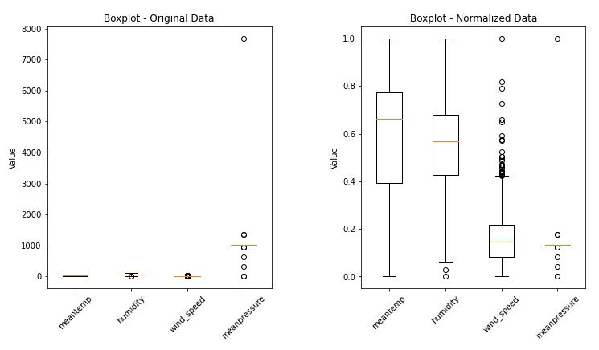
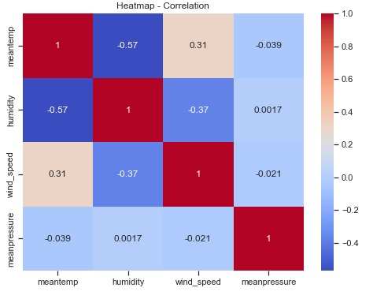
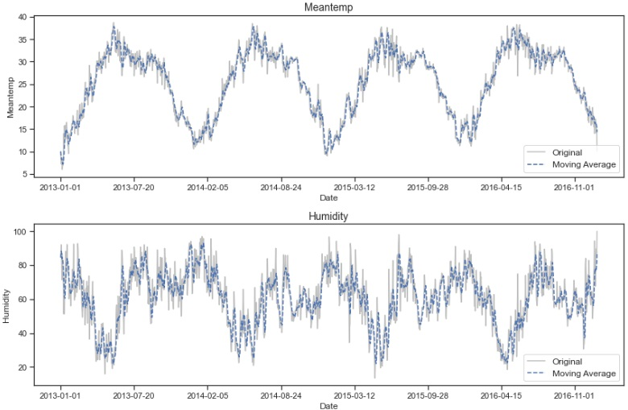
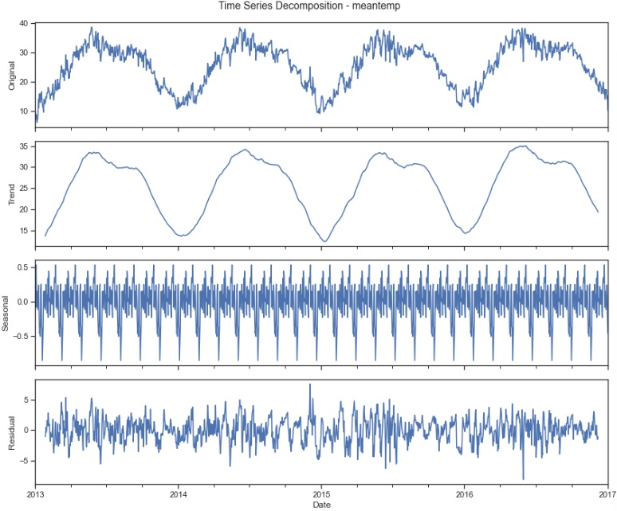

# 6 — Special Types of Data

This module extends exploratory data analysis to **special data types** that require dedicated representation and methods: **time series**, **text and documents**, and **trees/graphs/networks**.

## Learning outcomes

By the end of this module, you should be able to:

- Identify the defining characteristics of time series, text/document, and graph-based data.
- Perform descriptive exploratory analysis for each type (summary measures and structural indicators).
- Select and build appropriate visualizations to reveal patterns (trends/seasonality; lexical patterns; hierarchical and relational structures).
- Apply moving averages and seasonal decomposition to time series for trend/seasonality inspection.
- Create basic text representations (lexical representations, document-term matrices) and visualize text patterns.
- Compute and interpret core network measures (degree, density, centrality) and visualize networks using multiple layouts.

## 6.1 Time Series

A **time series (TS)** is a sequence of observations indexed by time. The temporal order introduces dependence patterns (trend, seasonality, autocorrelation) that require analysis methods beyond those used for independent observations.

### 6.1.1 Characteristics of Time Series

Time series may be observed at different granularities (e.g., milliseconds → years) and can be characterized by properties such as:
- **Time dependence** (ordering by time)
- **Trend** (long-term direction)
- **Seasonality** (repeating patterns over fixed intervals)
- **Cyclicity** (recurrent, but not necessarily fixed-period patterns)
- **Autocorrelation** (relationship between values at different lags)
- **Stationarity** (statistical properties remaining constant over time)

**Table:** Time series characteristics.
| Characteristic     | Description |
|--------------------|-------------|
| **Time dependence** | Time series data are ordered according to a given time scale. |
| **Predictability** | Time series can be either deterministic, in the sense that the series values can be predicted exactly, or stochastic (random), in the sense that future values are only partly determined by past values. |
| **Seasonality** | Seasonality is related to patterns that are repeated at fixed time intervals or within specific time periods. |
| **Cyclicity** | If the fluctuations in the time series behavior are not repeated at fixed time intervals or within specific periods, they are said to be cyclic. Thus, a seasonal behavior is a cyclic one that follows fixed time intervals. |
| **Autocorrelation** | Relationship of the data at different instants of time. |
| **Stationarity** | A time series may have some of its statistical properties constant over time. |
| **Trend** | A trend is a long-term pattern or direction presented by the time series, summarizing its behavior over longer periods of time. A trend can be increasing or growing, decreasing, or stable. |

### 6.1.2 Objectives of Time Series Exploratory Data Analysis

Common objectives include:
- **Description:** identify trend, seasonality, cycles, changes, and unusual events.
- **Explanation:** relate variations in the series to other variables or external factors.
- **Prediction:** forecast future values or patterns.
- **Control:** apply interventions to achieve a desired future behavior.

### 6.1.3 Time Series Descriptive Analysis

A typical starting point is **summary statistics** (mean, standard deviation, quartiles, min/max) computed across the time-indexed observations.

**Table:** Summary measures for the Daily Delhi Climate Train Data. <p>
| Statistic | meantemp | humidity | wind_speed | meanpressure |
|----------:|---------:|---------:|-----------:|-------------:|
| **mean** | 25.496 | 60.772 | 6.802 | 1011.105 |
| **std** | 7.348 | 16.770 | 4.562 | 180.232 |
| **min** | 6.000 | 13.429 | 0.000 | -3.042 |
| **25%** | 18.857 | 50.375 | 3.475 | 1001.580 |
| **50%** | 27.714 | 62.625 | 6.222 | 1008.563 |
| **75%** | 31.306 | 72.219 | 9.238 | 1014.945 |
| **max** | 38.714 | 100.000 | 42.220 | 7679.333 |

### 6.1.4 Time Series Data Visualization

Time series visualization most commonly uses **line charts** (value vs. time), potentially complemented by:
- **Boxplots** per period (e.g., month) to compare distributions across cycles.
- **Scatterplot matrices** to inspect relationships among multiple time-indexed variables.
- **Heatmaps/correlograms** for correlation structures.

#### Python Code — Line charts, boxplots, scatterplot matrix and heatmap

```python
# CODE 6.1
# Code to generate the line charts, boxplots, scatterplot matrix and heatmap
# of the Daily Delhi Climate Train Data

import pandas as pd
import matplotlib.pyplot as plt
import seaborn as sns

# Line charts for the Daily Delhi Climate Train Data
df = pd.read_csv('DailyDelhiClimateTrain.csv')
variables = ['meantemp', 'humidity', 'wind_speed', 'meanpressure']
dDelhi = df[variables]

# Line charts
fig, axes = plt.subplots(nrows=len(variables), figsize=(10, 16))
for i, var in enumerate(variables):
    axes[i].plot(df['date'], dDelhi[var], linestyle='-')
    axes[i].xaxis.set_major_locator(plt.MaxNLocator(integer=True))
plt.show()

# Box plots
dDelhi_normalized = (dDelhi - dDelhi.min()) / (dDelhi.max() - dDelhi.min())
fig, axes = plt.subplots(1, 2, figsize=(14, 6))
for i, ax in enumerate(axes):
    ax.boxplot(dDelhi if i == 0 else dDelhi_normalized)
    ax.set_title('Boxplot - {}'.format('Original Data' if i == 0 else 'Normalized Data'))
    ax.set_ylabel('Value')
    ax.set_xticklabels(variables)
plt.show()

# Scatterplot matrix and Heatmap for the Daily Delhi Climate Train Data
g = sns.pairplot(dDelhi)
plt.suptitle('Scatterplot Matrix', y=1.02)
plt.show()

# Heatmap
corr_matrix = dDelhi.corr()
plt.figure(figsize=(8, 6))
g = sns.heatmap(corr_matrix, annot=True, cmap='coolwarm')
plt.title('Heatmap - Correlation')
plt.show()
```

 <p>
 <p>
 <p>
 <p>

#### Prompt — Line charts, boxplots, scatterplot matrix and heatmap

```
You are a data visualization assistant supporting an **Advanced Exploratory Data Analysis (AEDA)** course.

Your task is to **exploratorily visualize a multivariate climate time series dataset** in order to understand temporal behavior, distributional properties, relationships among variables, and correlation structure.

## Dataset Context
- The dataset represents **daily climate measurements** collected over time.
- It contains one **time variable** (date) and multiple **continuous numerical variables** related to weather conditions (e.g., temperature, humidity, wind, pressure).

## High-Level Objectives

1. **Visualize temporal evolution**
   - Create a set of **line charts**, one per variable, showing how each climate variable evolves over time.
   - Align the time axis across plots to allow visual comparison of trends, variability, and potential seasonality.

2. **Compare distributions and scale effects**
   - Generate **boxplots** for all variables using:
     - The original data values.
     - A normalized version of the same variables.
   - Place both boxplots side by side to highlight differences in scale, spread, and outlier behavior.

3. **Explore pairwise relationships**
   - Produce a **scatterplot matrix** displaying all pairwise combinations of the numerical variables.
   - Use this visualization to inspect associations, clusters, nonlinear patterns, and potential outliers.

4. **Summarize correlation structure**
   - Compute the **correlation matrix** among the numerical variables.
   - Visualize it using a **heatmap** with annotated correlation values.
   - Use color intensity to emphasize the strength and direction of correlations.

## Expected Outcome

The result should be a coherent set of visualizations that together provide:
- Insight into **temporal dynamics** of each variable,
- Understanding of **distributional characteristics** and the impact of normalization,
- Visual assessment of **pairwise relationships**,
- A concise overview of **linear correlations** among variables.

The emphasis should be on **exploratory insight and interpretability**, not on implementation details or low-level plotting commands.
```

### 6.1.5 Moving Average and Seasonal Decomposition

#### Moving average (rolling mean)
A **moving average** smooths short-term fluctuations by averaging a window of size $w$:

$\hat{x}_t = \frac{1}{w}\sum_{i=0}^{w-1} x_{t-i}$

Larger windows produce smoother curves but can blur short-term changes.

#### Python Code — Moving averages for variables 'meantemp' and 'humidity'

```python
# CODE 6.2
# Moving averages for variables 'meantemp' and 'humidity' 
# of the Daily Delhi Climate Train Data

import pandas as pd
import matplotlib.pyplot as plt

# Load the dataset and extract the variables
df = pd.read_csv('DailyDelhiClimateTrain.csv')
dDelhi = df[['meantemp', 'humidity', 'date']]

# Create a single figure with subplots stacked vertically
fig, axes = plt.subplots(nrows=2, figsize=(12, 8))
vars_and_indices = [('meantemp', 0), ('humidity', 1)]
for var, i in vars_and_indices:
    axes[i].plot(dDelhi['date'], dDelhi[var], linestyle='-', color='gray', alpha=.5, label='Original')
    axes[i].plot(dDelhi['date'], dDelhi[var].rolling(window=5, min_periods=1).mean(), 
                 linestyle='--', label='Moving Average')
    axes[i].set_xlabel('Date') 
    axes[i].xaxis.set_major_locator(plt.MaxNLocator(integer=True))
    axes[i].legend(fontsize=12) 
    
# Save and display the plot
plt.savefig("Figure_6_5a_Moving_Averages_w5.svg", format="svg", dpi=1500, bbox_inches='tight')
plt.show()

# Create a single figure with subplots stacked vertically
fig, axes = plt.subplots(nrows=2, figsize=(12, 8))
vars_and_indices = [('meantemp', 0), ('humidity', 1)]
for var, i in vars_and_indices:
    axes[i].plot(dDelhi['date'], dDelhi[var], linestyle='-', color='gray', alpha=.5, label='Original')
    axes[i].plot(dDelhi['date'], dDelhi[var].rolling(window=20, min_periods=1).mean(), 
                 linestyle='--', label='Moving Average')
    axes[i].set_xlabel('Date') 
    axes[i].xaxis.set_major_locator(plt.MaxNLocator(integer=True))
    axes[i].legend(fontsize=12) 

plt.show()
```

 <p>


#### Prompt — Moving averages for variables 'meantemp' and 'humidity'
```
You are a data visualization assistant supporting an **Advanced Exploratory Data Analysis (AEDA)** course.

Your task is to **illustrate the effect of temporal smoothing on climate time series data** using moving averages, highlighting how different window sizes influence trend perception.

## Dataset Context
- The dataset contains **daily climate observations** recorded over time.
- Focus on two continuous variables:
  - Mean temperature
  - Humidity
- A time variable (date) defines the temporal ordering of observations.

## High-Level Objectives

1. **Visualize original time series behavior**
   - For each selected variable, plot its values over time using a line chart.
   - Use a consistent temporal axis to preserve continuity and allow direct visual interpretation of fluctuations.

2. **Apply and compare temporal smoothing**
   - Compute and overlay **moving average curves** on top of each original time series.
   - Use two different smoothing windows:
     - A **short-term window** to capture local variations.
     - A **long-term window** to emphasize broader trends.

3. **Organize visual comparison**
   - Arrange the visualizations in **stacked subplots**, one per variable, within the same figure.
   - Ensure both the original series and the smoothed series are visible simultaneously for comparison.

4. **Support interpretability**
   - Clearly distinguish original data from moving averages through line styles or visual emphasis.
   - Include legends and axis labels that reinforce the analytical goal.

## Expected Outcome

The resulting figures should:
- Reveal how short-term noise and long-term trends differ in climate variables,
- Demonstrate the impact of window size on smoothing strength,
- Support exploratory reasoning about trend, seasonality, and variability in time series data.

The focus should be on **conceptual understanding of temporal smoothing**, not on implementation details or plotting mechanics.
```

#### Seasonal decomposition
Seasonal decomposition separates a series into **trend**, **seasonal**, and **residual** components. Two common models are:

- **Additive:**
$y_t = T_t + S_t + R_t$

- **Multiplicative:**
$y_t = T_t \cdot S_t \cdot R_t$

**Python Code — Time series decomposition of the 'meantemp' variable**

```python
# CODE 6.3
# Time series decomposition of the 'meantemp' variable 
# of the Daily Delhi Climate Train data

import pandas as pd
import matplotlib.pyplot as plt
from statsmodels.tsa.seasonal import seasonal_decompose

# Load the dataset
dDelhi = pd.read_csv('DailyDelhiClimateTrain.csv')

# Extract the variable and set the date column as the index
variable = 'meantemp'
dDelhi['date'] = pd.to_datetime(dDelhi['date'])
dDelhi.set_index('date', inplace=True)

# Perform seasonal decomposition
decomposition = seasonal_decompose(dDelhi[variable], model='additive', period = 50)

# Plot the original, trend, seasonal, and residual components
fig, (ori, trnd, seas, resi) = plt.subplots(4, 1, figsize=(12, 10), sharex=True)
dDelhi[variable].plot(ax=ori)
ori.set_ylabel('Original', fontsize=14)
decomposition.trend.plot(ax=trnd)
trnd.set_ylabel('Trend', fontsize=14)
decomposition.seasonal.plot(ax=seas)
seas.set_ylabel('Seasonal', fontsize=14)
decomposition.resid.plot(ax=resi)
resi.set_ylabel('Residual', fontsize=14)

plt.xlabel('Date', fontsize=14)
plt.suptitle(f'Time Series Decomposition - {variable}', fontsize=16,  y=0.92)
plt.show()
```



**Prompt — Time series decomposition of the 'meantemp' variable**
```
You are a data visualization assistant supporting an **Advanced Exploratory Data Analysis (AEDA)** course.

Your task is to **decompose a climate-related time series into its fundamental components** in order to better understand its underlying structure.

## Dataset Context
- The dataset contains **daily climate observations** recorded over time.
- Focus on a single continuous variable representing **mean temperature**.
- A date variable defines the temporal ordering of the observations.

## High-Level Objectives

1. **Analyze the structure of a time series**
   - Treat the temperature measurements as an ordered time series indexed by date.
   - Preserve temporal continuity so that long-term and recurring patterns can be identified.

2. **Separate the time series into components**
   - Perform a **seasonal decomposition** using an additive model.
   - Decompose the series into the following components:
     - **Original series**: the observed data.
     - **Trend**: the long-term movement of the series.
     - **Seasonal**: repeating patterns occurring at regular intervals.
     - **Residual**: irregular fluctuations and noise not explained by trend or seasonality.

3. **Create a structured multi-panel visualization**
   - Display the original series and each decomposed component in **stacked subplots**.
   - Share the same time axis across all plots to enable direct comparison.

4. **Support interpretation and insight**
   - Clearly label each subplot according to the component it represents.
   - Use the visual layout to highlight how the observed data can be explained by trend, seasonality, and residual variation.

## Expected Outcome

The resulting figure should provide:
- A clear visual breakdown of how the temperature time series behaves over time,
- Insight into long-term trends and recurring seasonal effects,
- An understanding of the magnitude and nature of unexplained variability.

The emphasis should be on **conceptual understanding of time series decomposition** and exploratory insight, not on implementation details or plotting mechanics.
```

## 6.2 Text and Document Data

Text and document data are often **unstructured** or **semi-structured**. EDA for text typically starts by choosing a representation (lexical counts, bag-of-words, TF–IDF, embeddings) and then applying descriptive measures and visualizations tailored to language.

### 6.2.1 Objectives of Text and Document Exploratory Data Analysis

Typical objectives include:
- Identify **themes/topics** and frequently occurring terms.
- Compare language patterns across subsets (e.g., positive vs. negative reviews).
- Assess corpus properties (vocabulary size, sparsity, stop-word prevalence).
- Support downstream tasks such as classification, clustering, or retrieval.

### 6.2.2 Text Structuring

One way to analyze text computationally is to transform it into structured representations. Common choices include:
- **Lexical statistics** (counts of characters/words/sentences)
- **Bag-of-words / document-term matrix (DTM)**
- **TF–IDF** weighting
- **N-grams** and co-occurrence structures

#### Python Code — Structure texts using Lexical Representations (Part 1)

```python
# CODE 6.4a
# Code to structure texts using Lexical Representations

import nltk
from nltk.corpus import movie_reviews
from nltk.tokenize import word_tokenize
from nltk.corpus import stopwords
from nltk.stem import PorterStemmer
from sklearn.feature_extraction.text import CountVectorizer, TfidfVectorizer

# Download the IMDb corpus and the stoplist
nltk.download('movie_reviews')
nltk.download('stopwords')
nltk.download('punkt_tab')

# Load the movie reviews dataset
documents = [(list(movie_reviews.words(fileid)), category)
             for category in movie_reviews.categories()
             for fileid in movie_reviews.fileids(category)]

# Tokenization
tokenized_docs = [" ".join(words) for words, category in documents]

# Stopwords removal and printing
stop_words = set(stopwords.words('english'))
print("Stopwords contained in the stopwords file in NLTK:")
print(stop_words)
filtered_docs = [" ".join([word for word in word_tokenize(doc.lower()) 
                           if word.isalpha() and word not in stop_words])
                 for doc in tokenized_docs]

# Stemming
stemmer = PorterStemmer()
stemmed_docs = [" ".join([stemmer.stem(word) for word in word_tokenize(doc)])
                for doc in filtered_docs]
```

Stopwords contained in the stopwords file in NLTK:
{'she', 'themselves', 'doesn', 'such', 'at', "doesn't", 'so', 'when', "shan't", 'no', "hadn't", 'is', 'these', 'was', 'be', "wasn't", "i'll", 'it', 'ourselves', 'to', "should've", "shouldn't", 'couldn', 'or', "we'll", 'if', 'wouldn', "he'll", 'himself', 'each', 'has', 'aren', 'only', "it's", "didn't", 'who', 'through', 'while', 'weren', 'been', 'same', 'its', 'for', 'hadn', 'shan', 'under', 'with', 'y', 'hasn', 'had', 'what', 'hers', 'against', 'me', 'they', 'more', "mustn't", 've', 'does', 'ours', 'between', 'my', 'out', 'those', 'too', 'will', 'wasn', 'very', "aren't", 'until', 'are', 'didn', 'itself', "i'm", "he'd", 'both', 'mustn', "they've", 'now', 'doing', 'their', 'during', 'the', 'don', "that'll", 'an', 'here', 'him', 'herself', 'theirs', "she's", 'd', 'isn', 'up', "hasn't", 'down', "they'll", "she'd", 'myself', 'all', 'again', 'that', 'being', 'you', "isn't", 'then', 'there', 'her', 'our', 'as', 'any', 'of', "we're", 're', 'after', 'whom', "you're", "it'll", 'about', 'yours', "he's", 'ma', 'but', 'did', "you've", "couldn't", 'he', 'won', 'from', 'some', 'am', 'few', 'before', 'yourself', 'his', "it'd", 'nor', "needn't", 'own', 'll', 'off', 's', 'do', 'just', 'than', 'other', 'above', 'over', 'we', 'on', 'which', 'can', "she'll", "they're", 'why', "we've", 'by', "mightn't", 'i', "i've", 'ain', 'below', 'your', 'once', "you'll", 'further', "i'd", 'them', 'because', "they'd", 'where', 'o', 'this', 'into', 'should', 'most', 'having', 'shouldn', "you'd", 'mightn', 'a', "weren't", "don't", 'and', 'were', 't', 'in', 'have', "we'd", 'needn', 'not', 'yourselves', 'haven', "won't", "wouldn't", 'm', "haven't", 'how'}

#### Prompt — Structure texts using Lexical Representations (Part 1)

```
You are a data analysis assistant supporting an **Advanced Exploratory Data Analysis (AEDA)** course.

Your task is to **exploratorily structure a large collection of text documents** in preparation for descriptive analysis and visualization.

## Dataset Context
- The dataset consists of **movie review texts** written in natural language.
- Each document represents a full review and is associated with a sentiment category.
- The raw data is **unstructured text**, requiring transformation before analysis.

## High-Level Objectives

1. **Transform raw text into analyzable form**
   - Convert each document from free-form text into a structured representation suitable for quantitative analysis.
   - Treat documents as collections of words rather than continuous prose.

2. **Apply fundamental text preprocessing steps**
   - Tokenize documents into individual terms.
   - Normalize text by handling capitalization and non-alphabetic tokens.
   - Remove common stopwords that do not contribute meaningful information.
   - Reduce words to their base or root form to consolidate lexical variants.

3. **Prepare lexical representations**
   - Structure the processed documents so they can be used with:
     - Frequency-based lexical representations (e.g., term counts).
     - Weighted lexical representations that emphasize informative terms.
   - Ensure the output is compatible with document–term matrix construction.

4. **Support exploratory text analysis**
   - Enable subsequent tasks such as:
     - Term frequency analysis,
     - Vocabulary inspection,
     - Comparative analysis across document categories,
     - Visualization of prominent terms and patterns.

## Expected Outcome

The result should be a **cleaned and structured corpus of documents** where:
- Noise and irrelevant terms are minimized,
- Linguistic variability is reduced,
- Text data is ready for descriptive analysis and visualization.

The emphasis should be on **conceptual understanding of text structuring for exploratory analysis**, not on implementation details or low-level programming mechanics.
```

#### Python Code — Create the data matrix using different methods (Part 2)

```python
# CODE 6.4b
# Create the data matrix using different methods
# Binary

binary_vectorizer = CountVectorizer(binary=True)
data_matrix_binary = binary_vectorizer.fit_transform(stemmed_docs)

# Absolute Frequency
count_vectorizer = CountVectorizer()
data_matrix_abs_freq = count_vectorizer.fit_transform(stemmed_docs)

# Relative Frequency (Term-Frequency)
tf_vectorizer = CountVectorizer()
data_matrix_rel_freq = tf_vectorizer.fit_transform(stemmed_docs)

# TF-IDF
tfidf_vectorizer = TfidfVectorizer()
data_matrix_tfidf = tfidf_vectorizer.fit_transform(stemmed_docs)

# Printing the feature names (words) 
print("\nFeature names (words) for the Data Matrix:")
print(binary_vectorizer.get_feature_names_out()[:20])

# Printing each data matrix
print("\nBinary Data Matrix:")
print(data_matrix_binary[:5, :20].toarray())
print("\nAbsolute Frequency Data Matrix:")
print(data_matrix_abs_freq[:5, :20].toarray())
print("\nRelative Frequency (Term-Frequency) Data Matrix:")
print(data_matrix_rel_freq[:5, :20].toarray())
print("\nTF-IDF Data Matrix:")
print(data_matrix_tfidf[:5, :20].toarray())
```

Feature names (words) for the Data Matrix: <br>
['aa' 'aaa' 'aaaaaaaaah' 'aaaaaaaahhhh' 'aaaaaah' 'aaaahhh' 'aah' <br>
 'aaliyah' 'aalyah' 'aamir' 'aardman' 'aaron' 'aatish' 'ab' 'aback' <br>
 'abandon' 'abat' 'abb' 'abba' 'abber'] <br>

Binary Data Matrix: <br>
[[0 0 0 0 0 0 0 0 0 0 0 0 0 0 0 0 0 0 0 0] <br>
 [0 0 0 0 0 0 0 0 0 0 0 0 0 0 0 0 0 0 0 0] <br>
 [0 0 0 0 0 0 0 0 0 0 0 0 0 0 0 0 0 0 0 0] <br>
 [0 0 0 0 0 0 0 0 0 0 0 0 0 0 0 0 0 0 0 0] <br>
 [0 0 0 0 0 0 0 0 0 0 0 0 0 0 0 0 0 0 0 0]] <br>

Absolute Frequency Data Matrix: <br>
[[0 0 0 0 0 0 0 0 0 0 0 0 0 0 0 0 0 0 0 0] <br>
 [0 0 0 0 0 0 0 0 0 0 0 0 0 0 0 0 0 0 0 0] <br>
 [0 0 0 0 0 0 0 0 0 0 0 0 0 0 0 0 0 0 0 0] <br>
 [0 0 0 0 0 0 0 0 0 0 0 0 0 0 0 0 0 0 0 0] <br>
 [0 0 0 0 0 0 0 0 0 0 0 0 0 0 0 0 0 0 0 0]] <br>

Relative Frequency (Term-Frequency) Data Matrix: <br>
[[0 0 0 0 0 0 0 0 0 0 0 0 0 0 0 0 0 0 0 0] <br>
 [0 0 0 0 0 0 0 0 0 0 0 0 0 0 0 0 0 0 0 0] <br>
 [0 0 0 0 0 0 0 0 0 0 0 0 0 0 0 0 0 0 0 0] <br>
 [0 0 0 0 0 0 0 0 0 0 0 0 0 0 0 0 0 0 0 0] <br>
 [0 0 0 0 0 0 0 0 0 0 0 0 0 0 0 0 0 0 0 0]] <br>

TF-IDF Data Matrix: <br>
[[0. 0. 0. 0. 0. 0. 0. 0. 0. 0. 0. 0. 0. 0. 0. 0. 0. 0. 0. 0.] <br>
 [0. 0. 0. 0. 0. 0. 0. 0. 0. 0. 0. 0. 0. 0. 0. 0. 0. 0. 0. 0.] <br>
 [0. 0. 0. 0. 0. 0. 0. 0. 0. 0. 0. 0. 0. 0. 0. 0. 0. 0. 0. 0.] <br>
 [0. 0. 0. 0. 0. 0. 0. 0. 0. 0. 0. 0. 0. 0. 0. 0. 0. 0. 0. 0.] <br>
 [0. 0. 0. 0. 0. 0. 0. 0. 0. 0. 0. 0. 0. 0. 0. 0. 0. 0. 0. 0.]] <br>

#### Exercise 1: Generate the prompt to create the data matrix using different methods, as described in the code above.

### 6.2.3 Text and Document Descriptive Analysis

Useful descriptive statistics for a corpus include word count, unique word count, vocabulary size, most common words, sentence count, and stop-word count. Readability and part-of-speech distributions provide additional insight into linguistic complexity and style.

#### Python Code — Code to generate simple descriptive statistics for text data

```python
# CODE 6.5
# Code to generate simple descriptive statistics for text data

import nltk
from nltk.corpus import movie_reviews
from nltk.tokenize import word_tokenize, sent_tokenize
from nltk.corpus import stopwords
import string
from collections import Counter

# Download the IMDb dataset and stopwords corpus
nltk.download('movie_reviews'); nltk.download('stopwords')
# Load the movie reviews dataset
documents = [(movie_reviews.raw(fileid), category)
             for category in movie_reviews.categories()
             for fileid in movie_reviews.fileids(category)]

# Initialize variables for descriptive statistics
word_count = word_length_sum = sentence_count = sentence_length_sum = stopwords_count = 0
unique_words = set()
word_frequencies = Counter()

for document, _ in documents:
    # Tokenization and lowercase
    tokens = word_tokenize(document.lower())
    # Remove punctuation and digits
    tokens = [token for token in tokens if token.isalpha()]
    # Update word count and unique words
    word_count += len(tokens)
    unique_words.update(tokens)
    # Update word length sum
    word_length_sum += sum(len(word) for word in tokens)
    # Update word frequencies
    word_frequencies.update(tokens)
    # Sentence tokenization
    sentences = sent_tokenize(document)
    # Update sentence count and sentence length sum
    sentence_count += len(sentences)
    sentence_length_sum += sum(len(word_tokenize(sentence)) for sentence in sentences)
    # Count stopwords
    stopwords_count += sum(1 for token in tokens if token in stopwords.words('english'))

# Calculate descriptive statistics and print the results
print("Descriptive Statistics for the IMDb Dataset:")
print("Word Count:", word_count)
print("Unique Word Count:", len(unique_words))
print("Vocabulary Size:", len(unique_words))
print("Average Word Length:", word_length_sum / word_count)
print("Most Common Words:", word_frequencies.most_common(10))
print("Sentence Count:", sentence_count)
print("Average Sentence Length:", sentence_length_sum / sentence_count)
print("Number of Stopwords:", stopwords_count)
```

Descriptive Statistics for the IMDb Dataset: <br>
Word Count: 1,274,165 <br>
Unique Word Count: 38,107 <br>
Vocabulary Size: 38,107 <br>
Average Word Length: 4.540951917530304 <br>
Most Common Words: [('the', 76276), ('a', 37995), ('and', 35404), ('of', 33972), ('to', 31772), ('is', 26054), ('in', 21611), ('it', 16059), ('that', 15912), ('as', 11349)] <br>
Sentence Count: 65,258 <br>
Average Sentence Length: 23.369119494927826 <br>
Number of Stop words : 595,438 <br>

#### Prompt — Code to generate simple descriptive statistics for text data
```
You are a data analysis assistant supporting an **Advanced Exploratory Data Analysis (AEDA)** course.

Your task is to **perform a descriptive exploratory analysis of a large text corpus** in order to characterize its linguistic structure and basic statistical properties.

## Dataset Context
- The dataset consists of a collection of **movie review documents** written in natural language.
- Each document is unstructured text, potentially spanning multiple sentences and paragraphs.
- The goal is not sentiment modeling, but **descriptive understanding of the text data itself**.

## High-Level Objectives

1. **Characterize the corpus size and richness**
   - Determine the overall **number of words** in the corpus.
   - Measure **vocabulary size**, defined as the number of unique words.
   - Assess lexical diversity through unique-word counts.

2. **Analyze word-level properties**
   - Compute the **average word length** across the corpus.
   - Identify the **most frequent words** to understand dominant lexical patterns.
   - Quantify the presence of **stopwords** to evaluate the proportion of non-informative terms.

3. **Analyze sentence-level structure**
   - Count the total number of sentences in the corpus.
   - Compute the **average sentence length** in terms of words per sentence.
   - Use these measures to assess writing style and structural complexity.

4. **Support exploratory insight**
   - Provide numerical summaries that help answer questions such as:
     - How large and diverse is the vocabulary?
     - Is the text dominated by short or long words?
     - Are sentences generally short and simple or long and complex?
     - How much of the text is composed of common stopwords?

## Expected Outcome

The output should consist of a concise set of **descriptive statistics** summarizing:
- Corpus size and vocabulary characteristics,
- Word frequency patterns,
- Sentence structure and length,
- Relative prevalence of stopwords.

The emphasis should be on **exploratory understanding of text data**, not on predictive modeling, classification, or implementation details.
```

### 6.2.4 Text and Document Visualization

Common text visualizations include:
- **Word clouds** (quick salience view)
- **Frequency distributions** (top-$k$ words, n-grams)
- **Co-occurrence networks** (relationships among terms)
- **Parse trees / dependency graphs** (syntactic structure)

#### Python Code — Code to generate a Tag Cloud and a Frequency Distribution of the words in the IMDb corpus

```python
# CODE 6.7
# Code to generate a Tag Cloud and a Frequency Distribution of the words in the IMDb corpus

import nltk
from nltk.util import bigrams, trigrams
from nltk.corpus import movie_reviews
from nltk.probability import FreqDist
from nltk.tokenize import word_tokenize
from nltk.corpus import stopwords
from wordcloud import WordCloud
import matplotlib.pyplot as plt

print('working.....')
# Download the IMDb dataset and stopwords corpusz
nltk.download('movie_reviews')
nltk.download('stopwords')

# Load the movie reviews dataset
documents = [(movie_reviews.raw(fileid), category)
             for category in movie_reviews.categories()
             for fileid in movie_reviews.fileids(category)]

# Concatenate all the reviews into a single text
all_reviews_text = " ".join([text for text, _ in documents])

# Tokenization and Preprocessing
tokens = word_tokenize(all_reviews_text.lower())
tokens = [token for token in tokens if token.isalpha()]
filtered_tokens = [token for token in tokens if token not in stopwords.words('english')]

# Calculate word frequency
word_frequency = FreqDist(filtered_tokens)

# Generate the tag cloud
wordcloud = WordCloud(width=800, height=400, 
                      background_color='white').generate_from_frequencies(word_frequency)

# Display the tag cloud
plt.figure(figsize=(10, 5))
plt.imshow(wordcloud, interpolation='bilinear')
plt.axis('off')
plt.title('Tag Cloud for IMDb Dataset', fontsize=16)
plt.show()
```


**Figure placeholder — Dependency parse tree (example sentence)**


**Python Code — Code to generate the Dependency Parse Tree for the IMDb dataset in NLTK**

```python
# CODE 6.8
# Code to generate the Dependency Parse Tree for the IMDb dataset in NLTK

import nltk, spacy
from nltk.corpus import movie_reviews
from spacy import displacy
import en_core_web_sm
from pathlib import Path

# Download the IMDb dataset
nltk.download('movie_reviews')

# Load the movie reviews dataset
documents = [(movie_reviews.raw(fileid), category)
             for category in movie_reviews.categories()
             for fileid in movie_reviews.fileids(category)]

# Select the documents to be displayed
documents = documents[:1]

# Concatenate all the reviews into a single text
all_reviews_text = " ".join([text for text, _ in documents])

# Load the spaCy English model
nlp = en_core_web_sm.load()

# Process the text with spaCy
doc = nlp(all_reviews_text)

# Get individual sentences
sentences = list(doc.sents)

# Print each sentence and its dependency tree
for idx, sentence in enumerate(sentences):
    if idx == 1:
        print(f'Sentence: {sentence}')
        svg = displacy.render(sentence, style="dep", jupyter=False)
        file_name = 'Figure_6_10a_Dependency_Parse_Trees.svg'
        output_path = Path(file_name)
        output_path.open("w", encoding="utf-8").write(svg) 
    elif idx == 3:    
        print(f'Sentence: {sentence}')
        svg = displacy.render(sentence, style="dep", jupyter=False)
        file_name = 'Figure_6_10b_Dependency_Parse_Trees.svg'
        output_path = Path(file_name)
        output_path.open("w", encoding="utf-8").write(svg)
```


## 6.3 Trees and Networks

Trees and networks represent **relational structures** among entities (nodes) connected by edges. A **tree** is a special kind of graph with a hierarchical, acyclic structure; general **networks** may be directed/undirected and weighted/unweighted.

### 6.3.1 Concepts on Graph Theory

Key concepts include:
- **Graph:** $G=(V,E)$, with vertices (nodes) $V$ and edges $E$.
- **Directed vs. undirected** edges; **weighted** vs. unweighted.
- **Path, cycle, connectedness**, and **components**.
- **Adjacency matrix** $A$, where $A_{ij}$ encodes an edge from $i$ to $j$.

### 6.3.2 Objectives of Trees and Network Exploratory Data Analysis

Typical objectives include:
- Summarize structure (size, density, degree distribution).
- Identify important nodes (centrality) and communities (clusters).
- Reveal hierarchy in trees and flow patterns.
- Communicate structure via appropriate layouts and matrix-based views.

### 6.3.3 Descriptive Analysis for Trees

Tree-specific descriptive indicators include **height**, **diameter**, in-degree/out-degree distributions, node levels, and branching factors.


**Figure placeholder — Budget tree example and computed summary measures**


**Python Code — Nodes and edges that have to be loaded before running the next code (Part 1)**

```python
# CODE 6.9a
# Nodes and edges that have to be loaded before running the next code

# Add nodes (expense categories)
nodes = ["Gross Salary", "Expenses","House","Learn","Leisure","Grocery","Utils",
    "College","Others","Power","W&W","Rental","Maint","Savings","Invest","Retire"]

# Add edges (expense relationships) with values
edges = [
    ("Gross Salary", "Expenses", {'value': 5000}),
    ("Gross Salary", "Savings", {'value': 1000}),
    ("Expenses", "House", {'value': 1500}),
    ("Expenses", "Learn", {'value': 1600}),
    ("Expenses", "Leisure", {'value': 600}),
    ("Expenses", "Grocery", {'value': 900}),
    ("Expenses", "Utils", {'value': 400}),
    ("Learn", "College", {'value': 1200}),
    ("Learn", "Others", {'value': 400}),
    ("Utils", "Power", {'value': 250}),
    ("Utils", "W&W", {'value': 150}),
    ("House", "Rental", {'value': 1200}),
    ("House", "Maint", {'value': 300}),
    ("Savings", "Invest", {'value': 400}),
    ("Savings", "Retire", {'value': 600}),
]
```

**Python Code — Code to perform the Descriptive Analysis of trees (Part 2)**

```python
# CODE 6.9b
# Code to perform the Descriptive Analysis of trees
# It requires that the nodes and edges are loaded previously

import networkx as nx

# Create a directed graph
G = nx.DiGraph()
G.add_nodes_from(nodes)
G.add_edges_from(edges)

# Calculate and print measures
print("Number of nodes:", G.number_of_nodes())
print("Number of edges:", G.number_of_edges())

# Calculate height of the tree (maximum depth from root)
height = nx.dag_longest_path_length(G)
print("Height of the tree:", height)

# Calculate degree of each node
in_degree_dict = dict(G.in_degree())
out_degree_dict = dict(G.out_degree())
print("\nIn-Degree of each node:")
for node in nodes:
    print(f"{node}: {in_degree_dict.get(node, 0)}")
print("\nOut-Degree of each node:")
for node in nodes:
    print(f"{node}: {out_degree_dict.get(node, 0)}")

# Calculate branching factor (average out-degree)
branching_factor = G.number_of_edges() / G.number_of_nodes()
print("\nBranching factor:", branching_factor)

# Calculate and print tree diameter
diameter = 0
for node in nodes:
    if G.out_degree(node) == 0:  # Only consider leaf nodes
        path_lengths = nx.single_source_shortest_path_length(G.reverse(), source=node)
        max_path_length = max(path_lengths.values())
        diameter = max(diameter, max_path_length)
print("Tree Diameter:", diameter)

# Calculate level of each node (depth from the root)
root = "Gross Salary"
level_dict = {root: 0}
for node in nodes:
    if node != root:
        parent = list(G.predecessors(node))[0]  # Assuming single parent
        level_dict[node] = level_dict[parent] + 1
print("\nLevel of each node:")
for node in nodes:
    print(f"{node}: {level_dict[node]}")
```

### 6.3.4 Visualizing Trees

Tree visualization methods include **non-space-filling** (node-link diagrams) and **space-filling** approaches such as **treemaps** and **sunburst charts**.


**Figure placeholder — Genealogic tree representations (Queen Elizabeth II example)**


**Python Code — Code to generate partial genealogic trees of Queen Elizabeth II**

```python
# CODE 6.10
# Code to generate partial genealogic trees of Queen Elizabeth II
import matplotlib.pyplot as plt

# Define the family members and relationships
family_tree = {
    "Queen Elizabeth II": ["Prince Charles", "Princess Anne", "Prince Andrew", "Prince Edward"],
    "Prince Philip": ["Prince Charles", "Princess Anne", "Prince Andrew", "Prince Edward"],
    "Prince Charles": ["Prince William", "Prince Henry"],
    "Princess Anne": [],
    "Prince Andrew": [],
    "Prince Edward": [],
    "Prince William": ["Prince George", "Princess Charlotte", "Prince Louis"]}

# Print genealogy tree
print("Genealogical Tree:")
node_stack = [("Queen Elizabeth II", 0)]
while node_stack:
    node, depth = node_stack.pop()
    print("  " * depth + "|_" + node)
    if node in family_tree:
        for child in family_tree[node]:
            node_stack.append((child, depth + 1))

# Plot using Matplotlib
fig, ax = plt.subplots(figsize=(8, 6))
ax.set_xlim(0, 10)
ax.set_ylim(0, 6)

node_queue = [("Queen Elizabeth II", 5, 5.5)]
while node_queue:
    node, x, y = node_queue.pop(0)
    ax.text(x, y, node, ha='center', va='center', 
            bbox=dict(facecolor='lightblue', edgecolor='gray', boxstyle='round,pad=0.3'))
    if node in family_tree:
        num_children = len(family_tree[node])
        child_spacing = 18 / (num_children + 6)
        for i, child in enumerate(family_tree[node]):
            child_x = x + (i - (num_children - 1) / 3) * child_spacing
            child_y = y - 1
            ax.plot([x, child_x], [y, child_y], color='gray')
            node_queue.append((child, child_x, child_y))

plt.title("Genealogical Tree Visualization")
plt.axis("off")
```


**Figure placeholder — Treemap visualization (Budget Tree)**


**Python Code — Treemap example with the Budget Tree synthetic data**

```python
# CODE 6.11
# Treemap example with the Budget Tree synthetic data

import plotly.express as px
import plotly.io as pio

# Use kaleido as the image export engine
pio.kaleido.scope.default_format = "svg"

# Define data for the treemap
data = {
    'labels': ['Gross Salary','Expenses','Savings','House','Utils','Learn','Leisure','Market',
               'Invest','Retire','Rental','Maint','Power','W&W','College','Others'],
    'parents': ['', 'Gross Salary', 'Gross Salary', 'Expenses', 'Expenses', 'Expenses', 
                'Expenses', 'Expenses', 'Savings', 'Savings', 'House', 'House', 
                'Utils', 'Utils', 'Learn', 'Learn'],
    'values': [6000, 5000, 1000, 1500, 400, 1600, 600, 900, 400, 600, 1200, 300, 250, 
               150, 1200, 400]
}

# Create the treemap
fig = px.treemap(data, names='labels', parents='parents', values='values', branchvalues='total')

# Update the visual style
fig.update_traces(textinfo='label+percent entry+value', textfont=dict(size=20, family="Verdana, Bold"))
fig.update_layout(title_x=0.5)

# Save the figure as SVG
fig.write_image("Figure_6_14_Treemap_Budget_Tree_v2.svg", format='svg', width=1300, height=700)

# Display it
fig.show()
```


**Figure placeholder — Sunburst visualization (Budget Tree)**


**Python Code — Sunburst example with the Budget Tree synthetic data**

```python
# CODE 6.12
# Sunburst example with the Budget Tree synthetic data

import plotly.graph_objects as go

# Define data for the sunburst chart
labels = ['Gross Salary','Expenses','Savings','House','Utils','Learn','Leisure','Market',
         'Invest','Retire','Rental','Maint','Power','W&W','College','Others']
parents = ['','Gross Salary','Gross Salary','Expenses','Expenses','Expenses','Expenses',
           'Expenses','Savings','Savings','House','House','Utils','Utils','Learn','Learn']
values = [6000, 5000, 1000, 1500, 400, 1600, 600, 900, 400, 600, 1200, 300, 250, 150, 1200, 400]

# Create a sunburst chart
fig = go.Figure(go.Sunburst(labels=labels,parents=parents,values=values,branchvalues="total"))

# Set the title
fig.update_traces(textinfo='label+percent entry+value', textfont=dict(size=16, family="Verdana, Bold"))
fig.update_layout(title=None, title_x=.5, title_y=.85)

# Save and display the chart
fig.write_image("Figure_6_15_Sunburst_Budget_Tree.svg", format='svg', width=700, height=850)
fig.show()
```

### 6.3.5 Descriptive Analysis for Networks

Network descriptive analysis often includes:
- **Number of nodes** $|V|$ and **edges** $|E|$
- **Degree** statistics and degree distribution
- **Density** and clustering coefficients
- **Centrality measures** (degree, betweenness, closeness)


**Figure placeholder — Network summary measures and centrality examples**


**Python Code — Code to calculate Descriptive Statistics of the**

```python
# CODE 6.13
# Code to calculate Descriptive Statistics of the 
# Zachary's Karate Club Social Network

import networkx as nx

# Load the Zachary's Karate Club dataset
G = nx.karate_club_graph()

# Network Data Statistics
print("Is the graph a tree?", nx.is_tree(G))
print("Number of nodes:", G.number_of_nodes())
print("Number of edges:", G.number_of_edges())
print("Is the graph directed?", G.is_directed())
print("Is the graph connected?", nx.is_connected(G))
print("Average clustering coefficient:", nx.average_clustering(G))
print("Average shortest path length:", nx.average_shortest_path_length(G))
print("Number of connected components:", nx.number_connected_components(G))
print("Density:", nx.density(G))
print("Maximum degree:", max(dict(G.degree()).values()))
print("Minimum degree:", min(dict(G.degree()).values()))
print("Average degree:", sum(dict(G.degree()).values()) / G.number_of_nodes())
print("Assortativity coefficient:", nx.assortativity.degree_assortativity_coefficient(G))
print("Degree centrality:")
for node, centrality in nx.degree_centrality(G).items():
    print(f"Node {node}: {centrality:.4f}")
print("Betweenness centrality:")
for node, centrality in nx.betweenness_centrality(G).items():
    print(f"Node {node}: {centrality:.4f}")
print("Closeness centrality:")
for node, centrality in nx.closeness_centrality(G).items():
    print(f"Node {node}: {centrality:.4f}")
print("Eigenvector centrality:")
for node, centrality in nx.eigenvector_centrality(G).items():
    print(f"Node {node}: {centrality:.4f}")
```

### 6.3.6 Visualizing Networks

Network visualization depends strongly on **layout choice** (how nodes are placed). Common layouts include spring/force-directed, circular, spectral, and random layouts. Another complementary representation is the **adjacency matrix heatmap**.


**Figure placeholder — Network layouts (Zachary's Karate Club)**


**Figure placeholder — Adjacency matrix heatmap (Zachary's Karate Club)**


**Python Code — Code to Visualize the Zachary's Karate Club Social Network in different layouts**

```python
# CODE 6.14
# Code to Visualize the Zachary's Karate Club Social Network in different layouts
import networkx as nx
import matplotlib.pyplot as plt

# Load the Zachary's Karate Club dataset
G = nx.karate_club_graph()

# Plot using spring layout
pos_spring = nx.spring_layout(G, seed=4)
figA, (sprg, circ) = plt.subplots(nrows=2, ncols=1, figsize=(10, 12.5))

nx.draw_networkx(G, pos_spring, node_color='lightblue', font_size=8, edge_color='gray', ax=sprg)
sprg.set_title("Spring Layout", fontsize=16)

# Plot using circular layout
pos_circular = nx.circular_layout(G)
nx.draw_networkx(G, pos_circular, node_color='lightblue', font_size=8, edge_color='gray', ax=circ)
circ.set_title("Circular Layout", fontsize=16)

# Save and display the networks
plt.savefig("Figure_6_16a_Network_Layouts.svg", format="svg", dpi=1500, bbox_inches='tight')
plt.show()

figB, (shll, cstm) = plt.subplots(nrows=2, ncols=1, figsize=(10, 12.5))

# Plot using shell Layout
shell_layout = [list(range(0, 17)), list(range(17, 34))]
pos_shell = nx.shell_layout(G, nlist=shell_layout)
nx.draw_networkx(G, pos_shell, node_color='lightblue', font_size=8, edge_color='gray', ax=shll)
shll.set_title("Shell Layout", fontsize=16)

# Plot using spring layout with custom positions
pos_custom = nx.spring_layout(G, seed=4, iterations=200)
custom_positions = {0: (0.0, 1.5), 1: (.5, 1.5), 2: (0.5, -1.5), 33: (0.0, -1.5)}
pos_custom.update(custom_positions)
nx.draw_networkx(G, pos_custom, node_color='lightblue', font_size=8, edge_color='gray', ax=cstm)
cstm.set_title("Custom Spring Layout", fontsize=16)

# Save and display the networks
plt.savefig("Figure_6_16b_Network_Layouts.svg", format="svg", dpi=1500, bbox_inches='tight')
plt.show()
```
