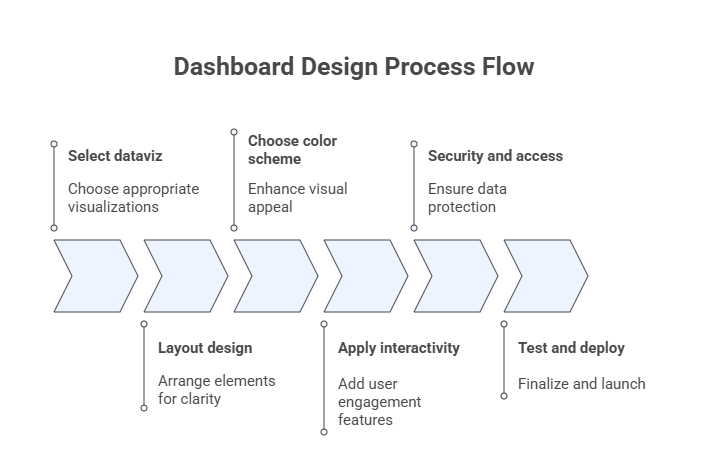
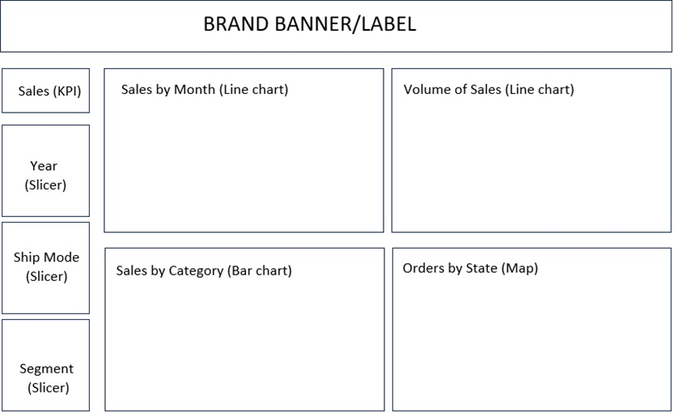
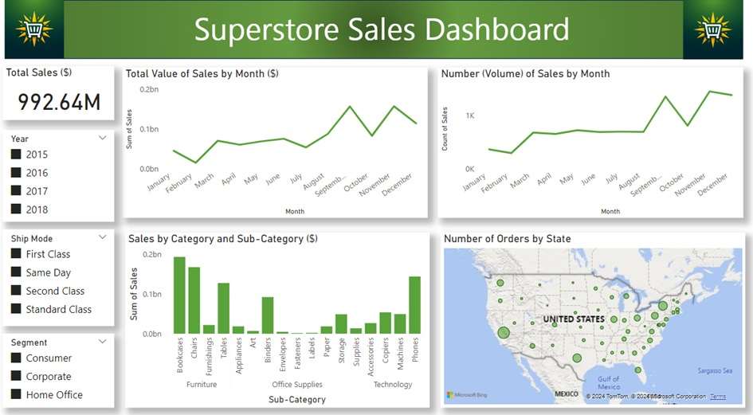

# 7 — Data Storytelling and Dashboard Design

This module integrates **exploratory data analysis, visualization principles, and communication** to transform analytical results into meaningful insights for decision-making. Data storytelling focuses on crafting a coherent narrative grounded in evidence, while dashboard design emphasizes interactive, visual summaries that support monitoring, exploration, and action.

Together, these components represent the culmination of Advanced Exploratory Data Analysis (AEDA): moving from data understanding to **insight communication and decision support**.

## Learning Objectives

By the end of this module, students will be able to:

1. Define audience, purpose, and context for data-driven communication.
2. Identify key analytical messages and appropriate levels of detail.
3. Structure data stories that combine narrative, evidence, and visualization.
4. Design dashboards that align visual encodings, layout, and interaction with analytical goals.
5. Apply best practices for usability, accessibility, and security in dashboards.
6. Develop an end-to-end data storytelling and dashboard solution using a real dataset.

## 7.1 Data Storytelling

**Data storytelling** is the practice of communicating insights derived from data through a structured narrative supported by appropriate visualizations. It combines three core elements:

* **Data**: reliable, well-analyzed evidence.
* **Narrative**: a logical structure that guides interpretation.
* **Visualization**: visual encodings that reduce cognitive load and emphasize meaning.

Effective data storytelling does not aim to show *everything* in the data, but rather to highlight what matters for a given audience and purpose.

**Figure:** Relationship among data, narrative and visuals for the storytelling design process.

### 7.1.1 Define the Audience and Purpose

The first step in data storytelling is to clearly define:

* **Audience**: executives, managers, analysts, domain experts, or the general public.
* **Purpose**: inform, explain, persuade, monitor, or support decision-making.

Audience characteristics determine:

* Level of technical detail
* Choice of metrics and visualizations
* Language, tone, and framing

A visualization that works for analysts may overwhelm decision-makers; conversely, oversimplification can obscure critical nuance for technical audiences.

 

**Figure:** Data storytelling process flow.

### 7.1.2 Identify the Key Message and Depth

A data story should revolve around a **small number of key messages** derived from exploratory analysis.

Key questions include:

* What is the most important insight?
* What evidence supports it?
* How much detail is necessary for this audience?

Depth should be adjusted by layering information:

* High-level summary for quick understanding
* Supporting views for deeper exploration
* Access to raw or detailed data when needed

### 7.1.3 Perform the Exploratory Data Analysis

Robust data storytelling is grounded in **rigorous exploratory data analysis**. Prior to narrative construction, the analyst should:

* Understand distributions, variability, and outliers
* Identify associations and trends
* Detect anomalies or unexpected patterns
* Validate data quality and assumptions

EDA ensures that the story is **evidence-based**, not anecdotal, and helps prevent misleading conclusions.

### 7.1.4 Prepare a Compelling Narrative

A compelling data narrative typically follows a logical structure, such as:

1. **Context**: why the problem matters
2. **Question**: what is being investigated
3. **Evidence**: key findings supported by data and visuals
4. **Insight**: interpretation of results
5. **Implications**: recommended actions or decisions

Narratives should be concise, focused, and aligned with the analytical goal. Visualizations should be integrated naturally into the story, reinforcing—rather than distracting from—the message.

The table below brings together the four core principles of storytelling design: defining the audience and purpose, identifying the central message and appropriate level of detail, conducting the exploratory data analysis, and crafting a compelling narrative. Once these elements are established, the analyst is prepared to proceed with the planning and design of the dashboard.

**Table:** Matrix with the four storytelling design principles.
| **Audience and Purpose** | **Exploratory Analysis** |
|--------------------------|--------------------------|
| • Specific group or individuals: demographics, interests, and knowledge level. • Clarify the objectives through the narrative. | • What questions do you want to answer with the data? • What kind of relationships exist in the data? • What are the best techniques for displaying the variables and their relationships? |
| **Key Message and Depth** | **Compelling Narrative** |
| • Central theme or insight: clear, concise, and relevant. • Depth: level of detail, context, and supporting data. | • Persuasive and impactful presentation. • Guide the audience through the insights and information. |

## 7.2 Dashboard Design

A **dashboard** is an interactive visual interface that consolidates key indicators, trends, and patterns into a single view. Dashboards are widely used for **monitoring performance, supporting decisions, crafting stories, and enabling exploratory analysis**.

Unlike static reports, dashboards emphasize:

* Interactivity
* Real-time or near–real-time updates
* User-driven exploration

The figure below summarizes the main steps  involved in the process of designing dashboards.

**Figure:** Dashboard design process flow.

### 7.2.1 Selecting Appropriate Visualizations

Visualization choices in dashboards should follow the same principles discussed in earlier modules:

* Match visualization type to data type and analytical goal
* Prefer simple, familiar charts for frequent monitoring
* Avoid unnecessary decoration or chart variety

Common dashboard elements include:

* KPIs and summary metrics
* Time series for trends
* Bar charts for comparisons
* Maps for spatial patterns

### 7.2.2 Designing the Dashboard Layout

Layout strongly influences usability and comprehension. Effective layouts:

* Follow a clear visual hierarchy (most important elements first)
* Use consistent alignment and spacing
* Group related elements logically
* Minimize scrolling when possible

A common strategy is a **top-down layout**, where high-level KPIs appear at the top and detailed views appear below.

### 7.2.3 Choosing a Color Scheme

Color should be used intentionally and sparingly. Good practices include:

* Use color to encode meaning, not decoration
* Maintain consistency across views
* Ensure sufficient contrast for readability
* Consider color-blind–safe palettes

Neutral colors are often preferable for backgrounds, while accent colors can highlight critical values, changes, or exceptions.

### 7.2.4 Applying Interactivity

Interactivity allows users to explore data dynamically. Common interactive features include:

* Filters and slicers
* Drill-down and drill-through actions
* Tooltips with additional context
* Linked views (brushing and highlighting)

Interactivity should enhance insight, not overwhelm the user. Each interactive element should have a clear purpose.

### 7.2.5 Security and Access Control

Dashboards often expose sensitive or strategic information. Key considerations include:

* Role-based access control
* Data anonymization when appropriate
* Secure authentication and authorization
* Compliance with organizational and legal requirements

Security should be addressed early in the design process, not as an afterthought.

### 7.2.6 Test and Iterate

Dashboard design is inherently iterative. Testing should involve:

* Real users from the target audience
* Representative tasks and scenarios
* Feedback on clarity, usability, and usefulness

Continuous iteration ensures that dashboards remain aligned with evolving data, goals, and user needs.

## 7.3 Case Study: Superstore Sales Dataset

This case study integrates **data storytelling and dashboard design** using the Superstore Sales dataset, a widely used benchmark in business analytics.

The dataset typically includes:

* Orders, customers, products, and categories
* Sales, profit, discounts, and quantities
* Temporal and geographic dimensions

### 7.3.1 Data Storytelling

The storytelling process begins by defining the business questions, such as:

* How are sales and profits evolving over time?
* Which regions and categories drive performance?
* Where are losses occurring?

Exploratory analysis is used to identify trends, patterns, and anomalies, which are then synthesized into a coherent narrative tailored to decision-makers.

### 7.3.2 Dashboard Design

The dashboard design phase translates the story into an interactive interface, typically including:

* High-level KPIs (total sales, profit, margin)
* Time series views for trends
* Comparative views by region, category, and segment
* Filters for time, geography, and product attributes

The final dashboard serves both as a **communication artifact** and a **decision-support tool**, allowing users to monitor performance and explore underlying drivers.

To illustrate, the wireframe presented in the figure below describes the layout to be used to build the dashboard.

 

**Figure:** Wireframe with the dashboad layout for the Superstore Sales dataset.

The figure below shows the final dashboard built using Power BI by Microsoft. 

## Reflection

* Who is the intended audience for your data story, and how does this influence visualization and narrative choices?
* How do you balance simplicity and completeness when communicating insights?
* In what ways can interactivity strengthen—or weaken—a data story?
* How does dashboard design differ when the goal is monitoring versus exploration?
* What ethical or security considerations arise when sharing analytical dashboards?

## Further Reading

Students are encouraged to consult the bibliography listed in the course syllabus, particularly:

* **De Castro, L. N. (2026).** *Exploratory Data Analysis: Descriptive Analysis, Visualization, and Dashboard Design*. CRC Press.
* **Knaflic, C. N. (2015).** *Storytelling with Data: A Data Visualization Guide for Business Professionals*. Wiley.
* **Ward, M., Grinstein, G. G., & Keim, D. (2015).** *Interactive Data Visualization*. CRC Press.
* **Wilke, C. O. (2019).** *Fundamentals of Data Visualization*. O’Reilly Media.
