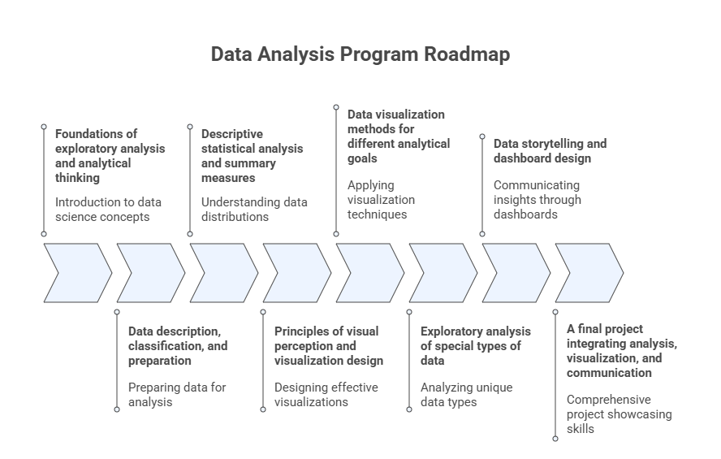

# Welcome to Advanced Exploratory Data Analysis (AEDA)

This program is designed to develop the analytical mindset, technical foundation, and communication skills required to transform raw data into meaningful insights that support understanding, monitoring, and decision-making.

Exploratory Data Analysis is not a preliminary or auxiliary activity. It is a **core analytical discipline** that determines how data is understood, how questions are framed, how results are interpreted, and how insights are communicated. Poor exploratory analysis leads to fragile conclusions, misleading visualizations, ineffective dashboards and inferences, regardless of how advanced the downstream tools may be.

This course emphasizes **thinking with data**, not merely processing it.

## What This Program Is About

Advanced Exploratory Data Analysis focuses on:

- Understanding the structure, behavior, and limitations of data
- Summarizing data through descriptive measures
- Revealing patterns, relationships, and anomalies
- Designing effective visual representations
- Communicating insights through storytelling and dashboards

Rather than emphasizing predictive modeling or inference, AEDA concentrates on **descriptive reasoning, visual cognition, and analytical judgment**, the foundations upon which reliable analytics and decision support systems are built.

This program prepares students to work confidently with unfamiliar datasets, ask the right analytical questions, and produce insights that are both technically sound and communicable to diverse audiences.

## Professional Orientation: BI and Data Analyst Careers (Learning Objectives)

This program is explicitly designed to support **Business Intelligence (BI) Analysts and Data Analysts**, providing the conceptual foundation and practical tools required for these roles.

Graduates of this program will be prepared to:

-	Understand the different terminologies in data science and the main available careers;
-	Understand the data science workflow;
-	Understand the basic structure of different sets of data;
-	Understand and characterize different sets of data;
-	Visualize different types of data in various ways;
-	Design key performance indicators and dashboards;
-	Understand how to use GenAI to perform exploratory data analysis.

While the tools and platforms used by organizations evolve, the analytical competencies developed in this course (data understanding, visual reasoning, and interpretive clarity) remain stable and transferable across industries and technologies.

## Learning Philosophy and Approach

This course adopts a **project-based and inquiry-driven approach** to learning. The emphasis is not on memorizing formulas or reproducing predefined outputs, but on developing the ability to reason analytically about data.

Key principles guiding this program include:

- **Understanding before automation**  
  Tools can accelerate analysis, but they cannot replace analytical judgment.

- **Visualization as reasoning, not decoration**  
  Visualizations are analytical instruments, not presentation artifacts.

- **Interpretation over execution**  
  Producing a chart or statistic is insufficient without understanding what it means, and what it does not mean.

- **Iteration and reflection**  
  Exploratory analysis is inherently iterative. Insights emerge through cycles of questioning, visualization, and refinement.

Throughout the course, students are encouraged to justify analytical choices, critique visualizations, and reflect on how design decisions influence interpretation.

 

**Figure:** Key principles guiding the program.

## The Role of Generative AI in This Course

Generative AI tools may be used in this program as **analytical co-pilots** that support exploratory work. When used responsibly, they can assist with:

- Structuring exploratory questions
- Drafting code, visualization or analysis
- Generating alternative analytical perspectives
- Supporting documentation and narrative construction

However, Generative AI does not replace:

- Statistical reasoning
- Visualization literacy
- Domain understanding
- Human judgment

In this course, AI is treated as a **supporting instrument**, not an authority. Analytical responsibility always remains with the analyst.

## How to Use This Book

This Jupyter Book is organized as a **progressive analytical journey**. Each module builds on concepts and skills introduced earlier.

You are encouraged to:

- Read concept sections carefully before engaging with code or figures
- Study visualizations as analytical arguments, not illustrations
- Use code examples as reference implementations, not templates to copy blindly
- Reflect on interpretation questions before moving forward

The goal is not to move quickly through content, but to develop durable analytical understanding.

## Program Roadmap at a Glance

The program follows a structured progression:

1. Foundations of exploratory analysis and analytical thinking  
2. Data description, classification, and preparation  
3. Descriptive statistical analysis and summary measures  
4. Principles of visual perception and visualization design  
5. Data visualization methods for different analytical goals  
6. Exploratory analysis of special types of data  
7. Data storytelling and dashboard design  
8. A final project integrating analysis, visualization, and communication  

By the end of the program, students will have experienced the full exploratory pipeline—from raw data to communicable insight.

 

**Figure:** Program roadmap.

## Reflection

As you begin this program, consider the following questions:

- Why is understanding data often more important than modeling it?
- How can visualizations both clarify and mislead?
- What responsibilities do analysts have when communicating insights?
- When does analytical automation help—and when does it hinder understanding?

Revisiting these questions throughout the course will help anchor your learning and guide your analytical practice.

## Further Reading

Students wishing to deepen their understanding of the topics introduced in this program are encouraged to consult the references listed in the course syllabus bibliography, including:

- **De Castro, L. N. (2026).** *Exploratory Data Analysis: Descriptive Analysis, Visualization, and Dashboard Design*. CRC Press.  
- **Triola, M. F. (2017).** *Elementary Statistics* (13th ed.). Pearson.  
- **Knaflic, C. N. (2015).** *Storytelling with Data: A Data Visualization Guide for Business Professionals*. Wiley.  
- **Ward, M., Grinstein, G. G., & Keim, D. (2015).** *Interactive Data Visualization: Foundations, Techniques, and Applications* (2nd ed.). CRC Press.  
- **Wilke, C. O. (2019).** *Fundamentals of Data Visualization*. O’Reilly Media.

These readings provide complementary perspectives on exploratory data analysis, visualization principles, data storytelling, and the analytical foundations that support modern data science and artificial intelligence.
